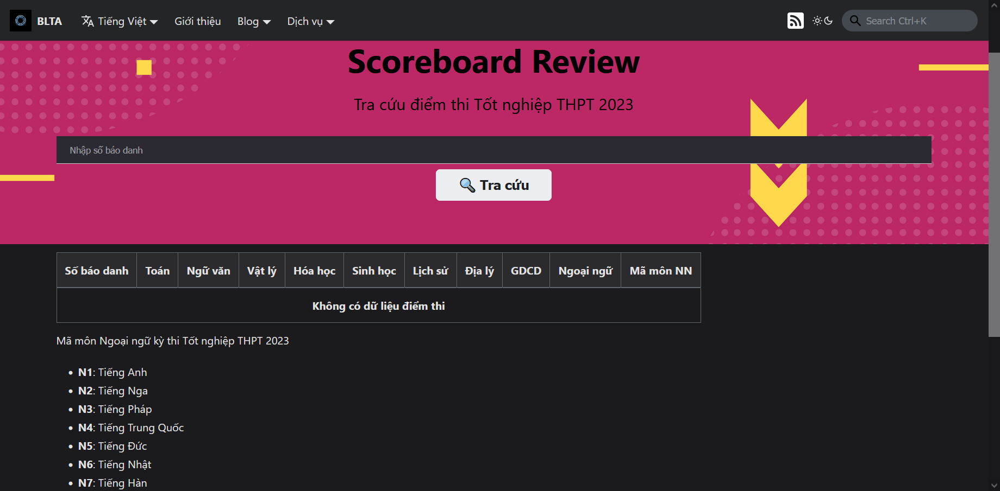

## Giới thiệu

Dịch vụ Scoreboard Review cho phép người dùng cập nhật thông tin mới nhất về kết quả kỳ thi Tốt nghiệp Trung học phổ thông cũng như xem những phân tích về kết quả thi của các tỉnh, thành phố trên cả nước.

## Hướng dẫn truy cập

Để sử dụng dịch vụ, có các cách sau:

1. Truy cập vào đường dẫn [**này**](../../services)
2. Từ thanh điều hướng, chọn **Dịch vụ**
3. Từ phần chân trang, mục **Trang chủ** chọn **Cổng dịch vụ**

Chọn dịch vụ **Scoreboard Review**, nhấn nút **Truy cập**. Hệ thống sẽ tự chuyển hướng đến trang của dịch vụ như hình dưới.

## Hướng dẫn tương tác

:::note LƯU Ý

Hệ thống hiện tại đang trong giai đoạn bảo trì để chuẩn bị cho kỳ thi Tốt nghiệp Trung học phổ thông năm 2024, do đó sẽ **không có kết quả thi** để tra cứu.

:::

Nhập mã số báo danh của thí sinh vào thanh tìm kiếm trung tâm, sau đó nhấn nút **Tra cứu**. Hệ thống tự động tìm và thông báo kết quả đến người dùng. Khi chưa hoặc không có kết quả, hệ thống sẽ thông báo cho người dùng như hình trên.

Ngoài ra, ở phần cuối của trang, người dùng có thể xem thống kê kết quả thi của các tỉnh, thành phố trên cả nước thông qua nút **Xem phân tích phổ điểm** (dẫn sang trang GitHub).
