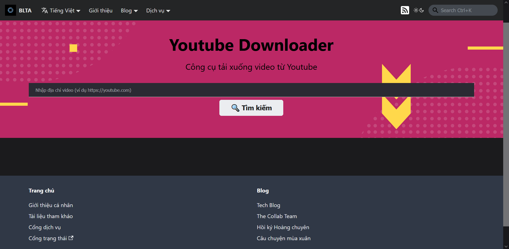
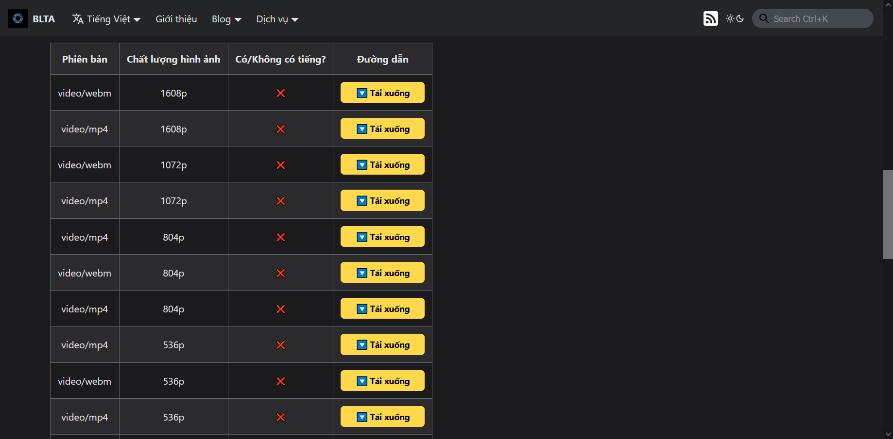

## Giới thiệu

Dịch vụ Youtube Downloader cho phép người dùng xem và tải xuống các video trên YouTube một cách nhanh chóng và dễ dàng, đồng thời hỗ trợ nhiều định dạng video/âm thanh khác nhau.

## Hướng dẫn truy cập

Để sử dụng dịch vụ, có các cách sau:

1. Truy cập vào đường dẫn [**này**](../../services)
2. Từ thanh điều hướng, chọn **Dịch vụ**
3. Từ phần chân trang, mục **Trang chủ** chọn **Cổng dịch vụ**

Chọn dịch vụ **Youtube Downloader**, nhấn nút **Truy cập**. Hệ thống sẽ tự chuyển hướng đến trang của dịch vụ như hình dưới.

## Hướng dẫn tương tác

1. Nhập địa chỉ video Youtube (có định dạng [https://www.youtube.com/watch?v=abcxyz](https://www.youtube.com/watch?v=abcxyz)) vào thanh tìm kiếm trung tâm, sau đó nhấn nút **Tìm kiếm**. Hệ thống tự động tìm và hiển thị kết quả đến người dùng. Khi không tìm thấy kết quả, hệ thống sẽ **thông báo lỗi**, người dùng có thể thử lại với địa chỉ khác.

2. Sau khi lựa chọn phiên bản phù hợp, nhấn nút **Tải xuống**. Hệ thống sẽ chuyển sang một trang có định dạng gần tương tự như hình dưới.

3. Nhấn chuột phải, chọn **Lưu video** hoặc **Lưu âm thanh**, đặt tên và nhấn **Lưu**. Hệ thống sẽ tự động tải xuống video/âm thanh với định dạng tương ứng.

## Một số giới hạn liên quan

Các video sau đây không thể tải xuống:

- **Giới hạn lãnh thổ**
- Quyền truy cập **Riêng tư**
- Video **cho thuê/mượn**
- Nội dung **Premium**
- Livestream định dạng **khác HLS**

Các đường dẫn tải xuống chỉ có giá trị trong vòng **6 giờ** và chỉ có thể tải xuống với **cùng địa chỉ IP** truy cập tương ứng. Hệ thống sẽ báo lỗi nếu video dính ít nhất một trong các giới hạn trên.
