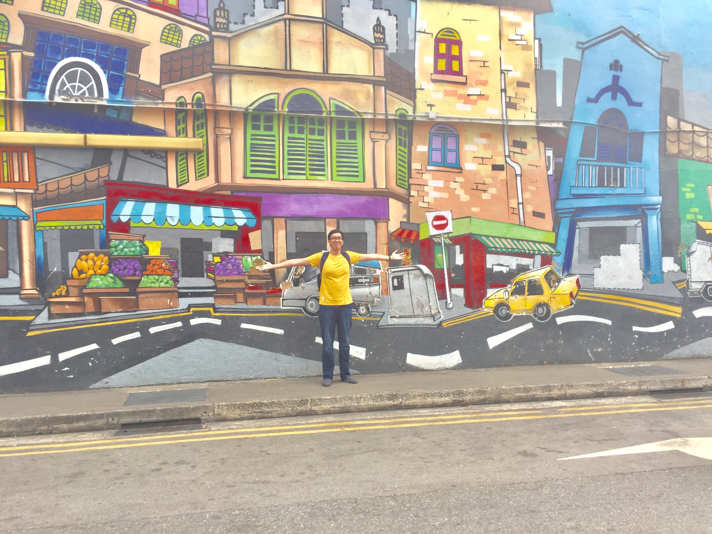

## Hình ảnh cá nhân

## Bảng thông tin

| Thuộc tính         | Giá trị                                                                        |
| ------------------ | ------------------------------------------------------------------------------ |
| 💳 Họ và tên       | **Anthony Bùi Lê Tuấn Anh**                                                    |
| 📅 Ngày sinh       | 27 tháng 08, 2001 (23)                                                         |
| 🏡 Quê quán        | Thị xã Hòa Thành, Tỉnh Tây Ninh, Việt Nam                                      |
| 📗 Vị trí công tác | **Kỹ sư hỗ trợ Công nghệ thông tin**                                           |
| 💻 Công ty         | **TNHH The Five Group, Úc**                                                    |
| 🏫 Trường học      | **_Trường Đại học Khoa học Tự nhiên, Đại học Quốc gia Thành phố Hồ Chí Minh_** |

## 💻 Github

