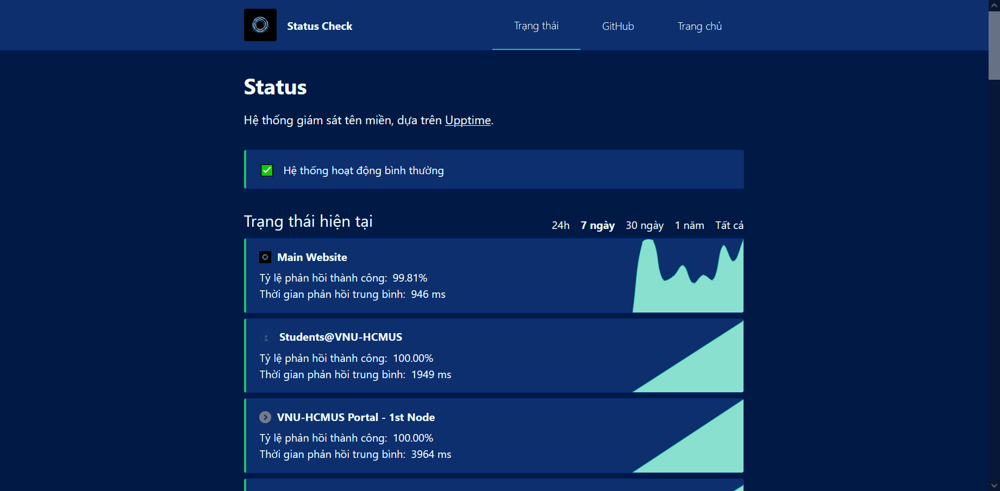

## Introduction

The Status Coverage service is a website that aggregates and monitors the status of different websites. This website is built on the [**Upptime**](https://upptime.js.org) platform.

## Guide to access

To use the service, there are the following ways:

1. Access from [**this link**](https://status.builetuananh.name.vn/)
2. From the **Navigation bar** on the top of this page, select **Services**
3. From the **Footer** at the end of this page, in the **Homepage** section select **Services Portal**

Select the **Status Coverage** service, then click on **Access**. The website will automatically be redirected to the service page as shown below.

:::note

The application interface uses **Vietnamese** as the official language.

:::

## How to use

### Current status

This section will display the current status of the monitored websites. This section provides two important information: the success response rate (**status code 200**) in **percentage** and the average response time in **milliseconds**. This status is updated continuously, and can be aggregated over **24 hours, 7 days, 30 days, 365 days** and **All time**.

### Detailed information

When selecting each website, the corresponding detailed information will be displayed, including:

- The success response rate (**Status Code 200**) in percentage
- The average response time in milliseconds
- The response time in **the last 7 days**
- The **incidents** that occurred with that website

### Incidents

For ongoing incidents, the system will update the **latest information** to the system. For incidents that have occurred, the system will save and display them on the website **below the Current Status section**.
