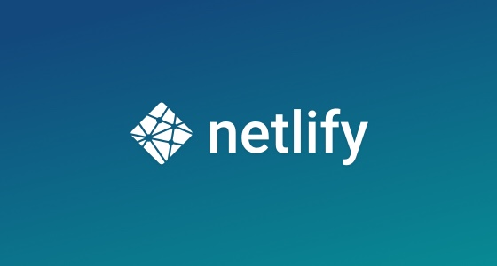

### Heroku và sự lựa chọn không thể quay đầu...

_Ngày **18/04/2022**, một vụ tấn công quy mô lớn đã diễn ra,
liên quan đến token OAuth2 và ảnh hưởng đến các dịch vụ
được rất nhiều công ty công nghệ sử dụng như ***Github, Travis CI & Heroku***.
Sau vụ việc nghiêm trọng này, Salesforce tuyên bố sẽ tiếp tục
trung thành với cam kết dịch vụ cung cấp cho các khách hàng..._

_Thế nhưng, sau hơn 10 năm, Heroku bất ngờ đưa ra một tuyên bố gây choáng:
**Dừng toàn bộ các dịch vụ miễn phí, bắt đầu từ ngày 28/11/2022**.
Toàn bộ các khách hàng, bao gồm cả tôi, đều được yêu cầu sẽ phải chuyển sang
dịch vụ trả tiền. Đây là một sự đi ngược lại với cam kết trước đó, mà theo như
Giám đốc điều hành Heroku - **Bob Wise** chia sẻ, để nhằm ngăn chặn việc ***lợi dụng***
các gói dịch vụ miễn phí được sử dụng sai mục đích ban đầu._

_Với tôn chỉ cung cấp dịch vụ miễn phí, tôi đã ngay lập tức tiến hành các biện pháp
kỹ thuật, **đóng toàn bộ dịch vụ trên Heroku** nhằm có thể tìm ra một giải pháp miễn phí
khác bền vững hơn. Và sau một thời gian tìm kiếm, Render bất ngờ ***"lọt vào tầm mắt"*** của tôi._

### Khám phá Render, Docker bị trôi vào quên lãng...

_Ngay sau khi chuyển sang Render, tôi thật sự bất ngờ với độ phủ dịch vụ
mà hệ thống này cung cấp. Gần như **tất cả dịch vụ** mà trước đó Heroku
từng cung cấp, Render đều có đủ, và thậm chí còn tốt hơn cả Heroku._

_Tôi lập tức bắt tay vào việc chuyển đổi. Quá trình chuyển đổi tốn nhiều
thời gian hơn dự kiến, do những vấn đề liên quan đến kiểm soát các đường
dẫn API để trang web chính thức có thể sử dụng và truy vấn được. Cuối cùng,
mọi thứ hoàn thiện và tiếp tục được duy trì cho đến ngày 15/09, khi tôi phát
hiện ra một tính năng hoàn toàn mới của Netlify, chính là **Netlify Functions**._

_**Netlify Functions** là một tính năng mới của Netlify, cho phép viết các hàm chạy
chương trình chuyên biệt. Thay vì phải xây dựng một máy chủ chỉ dành riêng cho
việc xử lý dữ liệu, giờ đây mọi thứ chỉ còn lại là một hàm duy nhất._

_Theo định hướng, ***Youtube Downloader*** đáp ứng hoàn toàn đầy đủ các tính chất
cho một dịch vụ con (**microservice**) và có thể triển khai dịch vụ này. Do đó từ ngày
**20/09/2022**, gói Docker trên **Github Container Registry** của Youtube Downloader
đã không còn tồn tại nữa, chuẩn bị cho quá trình chuyển đổi sang **Netlify Functions**._

### OPSWAT Vietnam và câu chuyện của AWS

_Ngày **24/08/2022** sẽ được ghi dấu ấn đặc biệt, bởi sau rất nhiều nỗ lực rải CV,
tôi cũng được nhận vào thực tập tại vị trí **Kỹ sư tin cậy hệ thống** - SRE (viết
tắt của **Site Reliability Engineer**) tại OPSWAT Vietnam. Đây là một công ty
chuyên về an ninh mạng có trụ sở chính tại Mỹ và văn phòng làm việc ngay
tại **Tòa nhà Báo Sài Gòn Giải phóng** trên đường Nguyễn Thị Minh Khai, Thành phố
Hồ Chí Minh. Và kể từ giờ phút ấy, AWS trở thành một người bạn đồng hành quen thuộc
của tôi trong quá trình học tập và làm việc._

_Khi tôi tìm hiểu thêm về AWS thông qua các khóa học online và đồ án cá nhân,
tôi phát hiện ra sự tồn tại của **AWS Lambda**, một dịch vụ hỗ trợ
chạy các hàm chuyên dùng cho xử lý dữ liệu mà không cần phải tạo máy chủ._

_Chính vì lí do đó, bắt đầu từ ngày **01/10/2022**, ngày cho ra mắt bài viết này,
tôi đã chính thức thực hiện chuyển đổi hoàn toàn sang chạy dịch vụ **Youtube Downloader**
với **Lambda Functions**._
