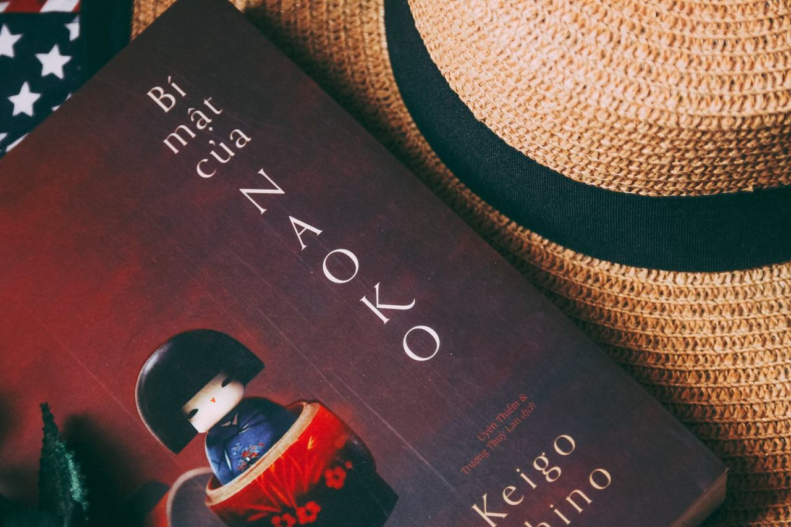

### BÍ MẬT CỦA NAOKO

_Bạn có phải tuýp người luôn **cảm thấy khó hiểu về mọi thứ** và phải đi tìm hiểu nó không? Hay bạn có phải là người **đam mê trinh thám**, tìm hiểu về trinh thám, hay thậm chí là đem trinh thám ra cả ngoài đời sống không? Nếu có thì có thể quyển sách hôm nay là dành cho bạn: **Bí mật của Naoko**._

_Đây là quyển sách trinh thám mà đối với bản thân tớ thì nó phản ánh rất đúng về con người của thời đại. **"Bí mật của Naoko" - con người của thời đại? Liệu có thật sự liên quan? Câu trả lời là có!**_

_Bí mật của Naoko, tác phẩm diễn ra trong bối cảnh tai nạn giao thông ngày một báo động. Hậu quả mà nó gây ra cho những người thân của người bị nạn là không thể tả xiết. Những ngày này tại Việt Nam **(tháng 01/2019)**, khi dư luận đang sục sôi vì vụ xe container tại Long An gây tai nạn vô cùng nghiêm trọng, tông thằng vào hàng loạt xe máy đang dừng chờ đèn đỏ, khiến ít nhất 4 người thiệt mạng và hàng chục người bị thương thì **Higashino** đã vẽ lên một bối cảnh tương tự trong tác phẩm này, người tài xế cũng kiệt sức vì lái xe đường dài và chạy nhiều chuyến xe liên tục, cũng gây ra tai nạn thảm khốc. Tất cả hiện lên rất chân thực, cữ ngỡ như là hôm qua. Chỉ có điều, quyển sách này đã được **Keigo** cho ra đời từ cách đây **hơn 10 năm rồi**! Và tính thời sự của nó, **cho đến hôm nay vẫn vẹn nguyên giá trị và trường tồn theo thời gian**._

_Chỉ sau chuyến tai nạn đó, mà **Hisuke** - một chàng kĩ sư trẻ đã mất đi cũng chẳng biết là vợ hay là con, bởi người vợ của anh - Naoko đã **nhập vào thân xác của đứa con gái Monami**. Cũng từ đó mà nhiều tình huống bắt đầu xảy ra với anh. Khi đọc truyện, đôi lúc ta cảm thấy Hisuke thật **ích kỷ**, nhưng đôi lúc lại rất **cao thượng**, hay Naoko cũng **đáng thương nhưng cũng đáng trách**... Cả một câu chuyện được chia ra làm từng mạch truyện nhỏ, để rồi khi đọc, ta cảm thấy chẳng ai đáng trách trong truyện cả, bởi Keigo không đơn giản là lên án một mà là **rất nhiều**... Chúng ta không có quyền phán xét ai cả, đơn giản vì **chúng ta không thể nào hiểu hết được bản chất của một con người**. Cái chúng ta thấy hằng ngày, trên báo đài, trên tivi hay trực tiếp qua những người mà ta gặp gỡ, hết thảy **chỉ là bề nổi** thôi. Con người là một thực thể phức tạp, nếu bạn nghĩ có thể đánh giá một người cách toàn diện chỉ qua quan sát thì tớ xin cam đoan, **bạn đã lầm**. Ai đã đọc Naoko rồi, chắc hẳn đều có cùng chung suy nghĩ với tớ, không phải Heisuke là người cao thượng nhất, hy sinh nhiều nhất trong tác phẩm._

**_Con người đôi lúc đáng thương, nhưng cũng đáng trách, và đáng thương hay đáng trách là do tấm lòng họ chọn..._**
