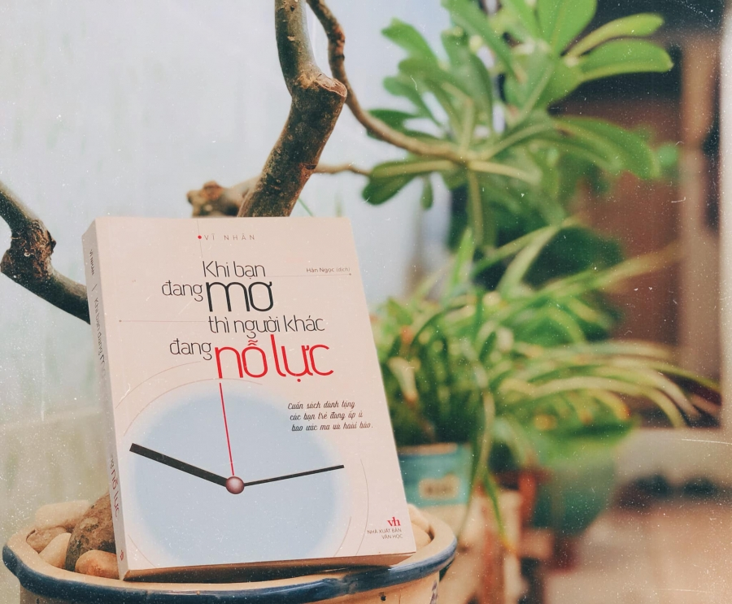

### KHI BẠN ĐANG MƠ THÌ NGƯỜI KHÁC ĐANG NỖ LỰC...

_Ai trong chúng ta cũng có ước mơ của chính mình. **Đúng vậy!** Đó là ước mơ của chính các bạn, là của riêng mỗi người. Vậy thử trả lời câu hỏi này nhé!_

> **_Nếu ước mơ đang ngay trước mặt bạn, bạn chọn cách chạy thật nhanh để với lấy nó hay sẽ từ từ chậm rãi mà đến?_**

**_Quyển sách này sẽ cho bạn câu trả lời về điều đó!_**

_Nếu bạn là người thật sự tốt, thật sự có ước mơ và muốn chạm tới nó nhưng do bản thân quá chủ quan,... thì hãy nên đọc quyển sách này để đổi mình nha._

_Quyển sách này gồm tám chương, trong mỗi chương chính là những phương pháp **mini** giúp bạn đạt đến ước mơ. **Tại sao là mini?** Vì đây chính là những điều nhỏ nhặt nhất mà chính chúng ta cũng có thể làm. Và điều đặc biệt nhất vẫn luôn nằm ở cuối, khi ở chương cuối cùng chính là lời gửi gắm cho sự phấn đấu của bạn._

_Qua những trang sách, tác giả mong muốn rằng mỗi bạn trẻ hãy phấn đấu để trở thành người mà bạn muốn, những gì bạn làm hôm nay sẽ quyết định đến kết quả của ngày mai, thế giới không chờ bạn chập chững bước đi mà cần bạn phải tăng tốc thật nhanh, người khác đã chạm đến ước mơ, bạn không thể vẫn tiếp tục mơ mà chỉ còn cách nỗ lực hơn để đuổi kịp theo họ. **Thời gian sẽ không dung túng và chờ đợi những kẻ lười biếng, lãng phí thời gian**. Thế giới này cũng vậy đúng như tên của quyển sách "**Khi bạn đang mơ thì người khác đang nỗ lực**"._

_Bạn không thể đứng mãi ở vạch xuất phát, tuổi trẻ sống là để vươn lên, để sau này có cái để tự hào những việc mình đã làm. Khó khăn và thất bại là đòn bẩy để bạn thay đổi và nhìn lại bản thân chứ không phải là rào cản. **Hãy đọc và cảm nhận cuốn sách "Khi bạn đang mơ thì người khác đang nỗ lực" để có thêm niềm tin và động lực để vượt qua những cảm xúc hoang mang, rối bời và mơ hồ trong hiện tại và có thể vững bước trên con đường chinh phục ước mơ thành công nhé!**_
