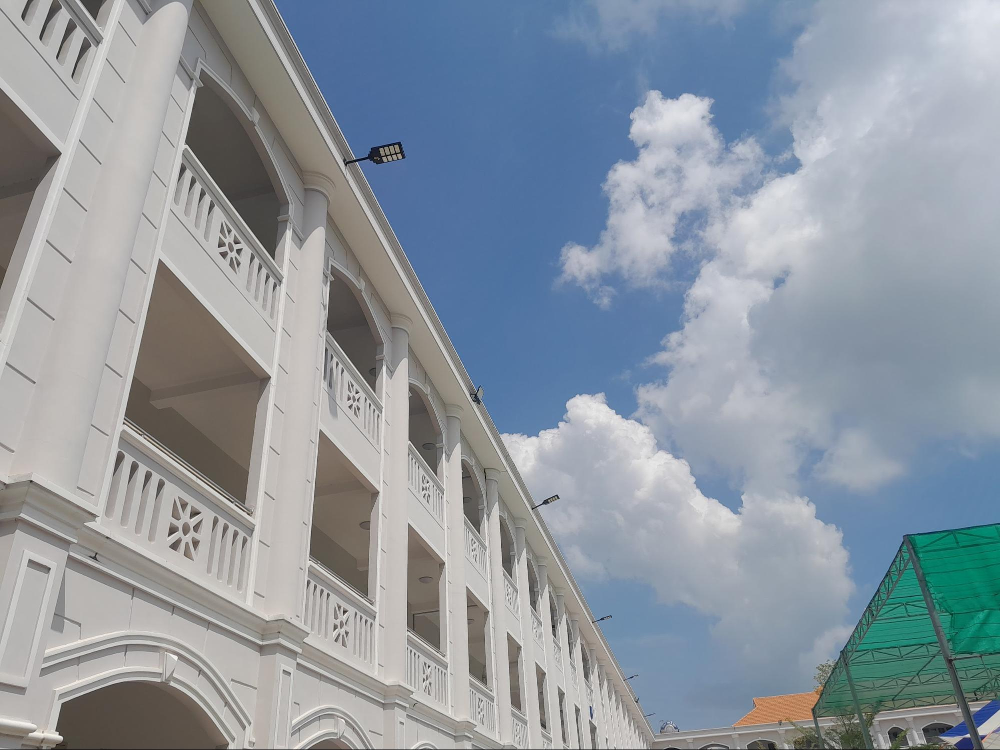

## Kỳ 5: KÌ THI TUỔI MƯỜI TÁM 📝

**_Này bạn của tôi ơi, ba năm qua trôi nhanh thật nhỉ?_**

_Mới hôm nào, buổi lễ khai giảng đầu tiên long trọng diễn ra trong niềm hân hoan xen lẫn sự thơ ngây của những đứa trẻ chập chững tuổi mười lăm. Mới hôm nào, những đứa trẻ ấy bước vào những tiết học đầu tiên trong sự bỡ ngỡ. **Mới hôm nào thôi mà...**_

**_Bây giờ, những đứa trẻ này sắp phải đối diện với kì thi Tốt nghiệp Trung học phổ thông. Nghĩa là, thời học sinh dần đi vào hồi kết rồi đấy._**

_Nhìn các bạn học sinh Khóa 27 những ngày này, có người thì chăm chỉ ra quán cafe học bài, có người thì xét vào đại học bằng nhiều phương thức khác nhau, tôi như thấy lại hình ảnh của chính tôi **cách đây đúng một năm trước...**_

_Ngày này năm ngoái, có lẽ tôi vẫn đang miệt mài ôn luyện ba môn Ngữ văn, Lịch sử, Địa lý. Tôi như một con ngựa hăng dốc hết sức lực, điên cuồng cày cuốc tài liệu từ trên giấy đến trên Google chỉ để tìm kiếm một cơ hội tỏa sáng trong kì thi cuối cùng của cuộc đời học sinh. Bởi đối với tôi khi ấy, mục tiêu **đậu vào đại học** quan trọng hơn tất thảy thứ khác mà, tôi chẳng thể nào buông lơi được._

_Xui cho tôi là trong giai đoạn ôn thi tốt nghiệp, **tôi mắc phải COVID, kèm theo một tâm lý vô cùng bất ổn**. Sức khỏe của tôi đã xuống dốc khá nhiều, dù vậy tôi vẫn bất chấp ôn thi. Tôi vẫn nhớ mãi những buổi đêm muộn màng vẫn tiếp tục luyện đề mặc cho cơn ho khan đến tắt tiếng, cơn mỏi mệt trong cơ thể hành hạ đến kiệt sức. **Hy vọng đừng bạn nào như mình nhé**_ 😢. _Trong thời gian ấy, tôi suy nghĩ tiêu cực khá nhiều, tôi thậm chí đã vẽ ra viễn cảnh nếu trượt tốt nghiệp sẽ như thế nào, và **tôi lại bật khóc vì điều ấy...**_

**_Những gánh nặng thay phiên đè nặng trên tấm lưng của một cô bé tuổi mười tám..._**

**_Nhưng, may mắn làm sao!_**

_Bên cạnh tôi **vẫn còn gia đình**, một hậu phương vững chắc để tôi yên tâm tựa vào, để tiếp thêm năng lượng cho tôi "chiến đấu". Tôi nhớ mãi tô hủ tiếu mẹ nấu cho tôi trong quãng thời gian bị COVID. Tôi nhớ mãi những ngày ba mẹ thay phiên nhau chở tôi đến điểm thi. Tất cả thành viên trong nhà đều âm thầm truyền năng lượng cho tôi bằng nhiều cách khác nhau._

_Bên cạnh tôi **vẫn còn thầy cô tiếp lửa**. Vào giai đoạn này, cả thầy cả trò đều miệt mài đến chỗ ôn luyện để dốc lòng cho kì thi. Trừ vài hôm tôi bị COVID, tôi chẳng nghỉ bất kể ngày nào. Ngày cuối cùng trước khi thi, các thầy cô đã động viên tôi rất nhiều, chúc tôi thi thật tốt. Thầy cô vẫn luôn thương yêu, vẫn luôn dõi theo bước chân của học trò, dẫu khi còn bé thơ hay đã bay cao bay xa trên không trung của bản thân._

_Bên cạnh tôi **vẫn còn những người bạn** đáng yêu, luôn đồng hành tương trợ, luôn giúp đỡ hết lòng. Họ sẵn lòng để tấm vai cho tôi tựa vào mỗi khi cần. Họ luôn âm thầm ủng hộ sự lựa chọn của tôi, luôn ủng hộ con đường văn học của tôi. Những khi cảm thấy mệt mỏi, chúng tôi sẽ tìm đến nhau, sẽ truyền lửa cho nhau để cùng bước qua kì thi này. Nếu không có họ, cuộc đời của tôi hẳn sẽ là một bức tranh không có sắc màu._

_Quãng thời gian này tuy mỏi mệt thật đấy, mồ hôi và nước mắt cùng đổ xuống trên trang sách vở. **Nhưng tin tôi đi, đây sẽ là quãng thời gian không thể nào quên được trong cuộc đời của bạn**. Bởi đây không chỉ đánh dấu bước ngoặt của cuộc đời bạn, mà đây chính là minh chứng cho sự nỗ lực của bạn trong suốt mười hai năm học qua, là hành trang quý giá để bạn chuẩn bị bước vào **thế giới của người trưởng thành...**_

> **_Làm gì có ai một đêm thành danh, tất cả đều là bách luyện thành thép._**
>
> **_Dịch Dương Thiên Tỉ_**

Lời chúc từ The Collab Team

_Sau cùng, xin gửi lời chúc đến các sĩ tử năm 2023:_

**_Mười hai năm học, không quá dài nhưng cũng không ngắn, sẽ chính thức khép lại sau vài ngày nữa thôi. Thời gian qua, các bạn đã nỗ lực rất nhiều rồi! Mình tin các bạn sẽ vượt qua được, nhất định cập bến thành công. Chúc các bạn thuận buồm xuôi gió, gặt nhiều trái ngọt. Hy vọng mọi sự chọn lựa của các bạn sẽ thành hiện thực, và các bạn sẽ được tung cánh trên ước mơ của bản thân trong niềm hạnh phúc vô bờ!_**

