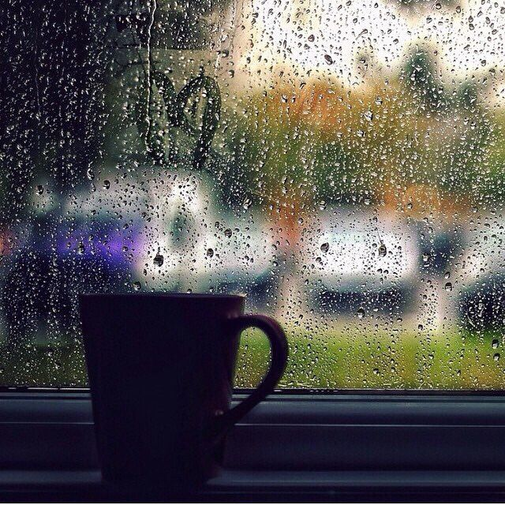

### MỘT CHÚT DỄ THƯƠNG ♥

> Nguồn: Internet (Pinterest)

_Có đợt trời mưa, khoá từ của xe mình gặp trục trặc, mình đứng cả giờ đồng hồ để khoá từ êm xui trở lại. Khi đó điện thoại mình để trong cốp, mình có hỏi mượn điện thoại của chú bảo vệ gần đó để gọi cho ba._

_Chú cho mình mượn, còn nói thêm:_

> **_Cần chú xem giúp không? Chắc trời mưa nên trục trặc tí._**

_Khi mọi thứ ổn áp mình có tặng chú ly cà phê._

_Mình nghĩ đến bạn giữ xe ở The Coffee House chi nhánh Huỳnh Tấn Phát. Đối với mình, một người giữ xe chỉ cần dắt xe mình nhẹ nhàng với thái độ tử tế là mình đã rất hài lòng rồi. Hôm nay ghé quán, mình có tặng bạn đó cái bánh donut._

> - **_Gửi bạn nè, cảm ơn vì đã dắt xe mình rất tử tế._**
> - **_Dạ?_**
> - **_Gửi bạn á, cảm ơn bạn vì luôn dắt xe mình tử tế._**
> - **_Mình cảm ơn._**

_Ngày trước, mình là người được nhận yêu thương từ những người xung quanh. Nhưng mà bây giờ, mình nghĩ rằng, nếu mình cũng là người cho đi những yêu thương và sự dịu dàng thì mình sẽ vui hơn._

**_Khi còn có thể, hãy dịu dàng với nhau._**
