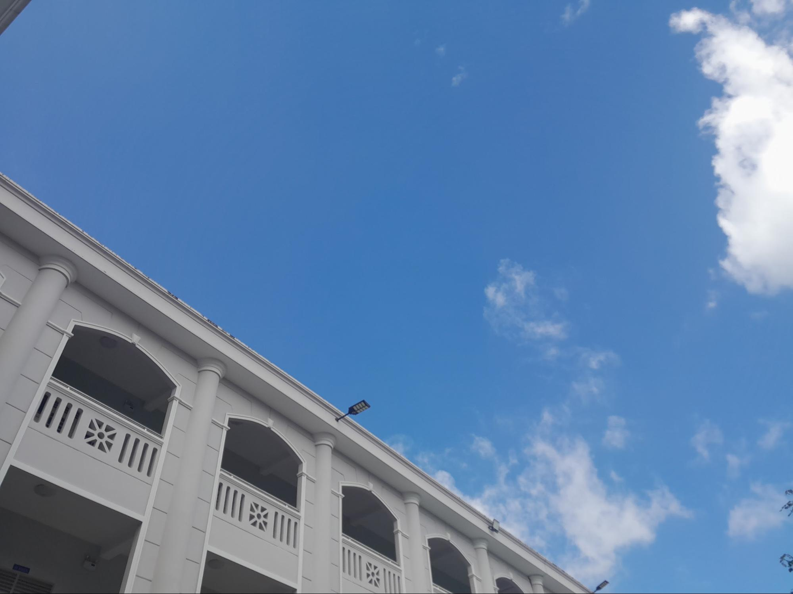

## 2023: ĐÓA HOA TRI THỨC NỞ RỘ...

**_Này bạn của tôi ơi, bạn còn ở đây với tôi không?_**

_Mới hôm nào, "**đám nhóc con**" chúng ta vẫn còn tưng bừng nô nức đón chào một năm học mới, vậy mà thấm thoát đã trôi qua một khoảng thời gian rồi. Hiện tại, tôi đã dần quen với cuộc sống sinh viên hơn, nhưng tôi cảm thấy bản thân không thật sự hào hứng với điều này. Biết bao áp lực liên tục dồn dập, khiến cho tôi nhiều lúc chẳng còn sức lực nào để bước tiếp trên hành trình theo đuổi khát vọng của bản thân. **Chẳng biết là bạn có như tôi không nhỉ?**_

_Dần dà, bạn và tôi đều dần cuốn theo vòng xoáy của cuộc sống..._

_Chẳng mấy chốc, tháng mười một đã trở về. Tháng mười một... có phải là sắp diễn ra một dịp nào đó thật đặc biệt, đúng không nhỉ? Đợi tôi nhớ lại xem nào..._

**_À, nhớ ra rồi..._**

**_Ngày Nhà giáo Việt Nam sắp đến rồi đấy!_** 😊

> **_Này em ơi, tháng mười một về rồi_**
>
> **_Bao hình ảnh thân thương chợt hiện ra_**
>
> **_Trong trái tim em có còn bồi hồi_**
>
> **_Bởi đã lâu em chưa trở về "nhà"?_**

_Khi ra trường, tôi đã đặt một lời hẹn rằng cứ đến dịp lễ Ngày Nhà giáo Việt Nam, tôi nhất định sẽ trở về thăm những người thầy cô của mình. Năm nay, tôi cũng sẽ cố gắng dành ra chút thời gian để trở về thăm họ, như một cách để sạc lại năng lượng cho chặng đường sắp tới đây._

_Quay trở về tầm bốn năm trước, khi tôi chỉ là một cô nữ sinh vừa chớm tuổi mười lăm giương cặp mắt non nớt khám phá từng ngóc ngách ở môi trường cấp Ba, tôi không thể che giấu được niềm hân hoan, vui sướng. Có lẽ, được bước vào ngôi trường chuyên danh giá của tỉnh là niềm tự hào của biết bao đứa trẻ nói chung và tôi nói riêng, bởi nơi đây không chỉ là cánh cửa mở ra vô vàn cơ hội vàng, mà nơi đây còn truyền cho tôi hơi ấm của tình thương yêu. Những con người ở Hoàng chuyên, cụ thể hơn là những người thầy, người cô đã âm thầm dẫn dắt biết bao chuyến đò tri thức cập bến thành công, đã nuôi dưỡng tâm hồn cho rất nhiều đứa trẻ đang đứng trước ngưỡng cửa mang tên "**trưởng thành**"._

_Dù tôi đã là "**học sinh lớp 14**", nhưng kỉ niệm với thầy cô vẫn còn lưu mãi trong thước phim ký ức của tôi... **Nào, cùng ôn lại kỉ niệm với tôi một chút nhé!**_

_**Nếu văn chương là người bạn đời kề vai sát cánh trên mọi nẻo đường của tôi, thì thầy cô ở Hoàng chuyên chính là sợi dây gắn kết tôi và văn chương ngày một bền chặt hơn**. Tổ Văn ở trường tôi là những người cô, người thầy vô cùng chất lượng, dễ thương, tâm lý, luôn tận tâm tận lực với nghề nghiệp và với học trò thân yêu của mình. Có lẽ tôi kể về họ với mọi người nhiều không đếm được, nhưng cũng là vì tôi thật sự rất kính trọng và thương yêu họ rất nhiều! Dẫu tôi đã từng không có thiện cảm với chính môn học này, dẫu biết bao lần văn chương làm tôi òa khóc nức nở vì đã làm tôi vấp ngã đau đớn, nhưng nhờ có đôi tay dìu dắt cùng với trái tim ấm áp của thầy cô đã nâng đỡ, đã sưởi ấm cho tôi rất nhiều. Thầy cô đã nhẫn nại, kiên trì dẫn tôi khám phá từng ngóc ngách trên hành trình mang tên "**Văn Chương**", luôn dạy tôi rằng giải thưởng không bao giờ là đích đến cuối cùng, mà đích đến thật sự chính là cách đối nhân xử thế, là cách học sinh vận dụng bài học nhân sinh vào thực tiễn đời sống. Đó cũng chính là chức năng của văn chương. Làm sao tôi có thể quên họ được cơ nhỉ? Bởi họ đã, đang và sẽ mãi là điểm tựa của tôi, để những khi tôi cảm thấy mất phương hướng, tôi lạc trong sự hỗn độn thì tôi hoàn toàn có thể trở về tìm họ nạp lại năng lượng cho bản thân. **Nhất định, tôi sẽ trở về thăm họ ngay thôi!**_

_Nhưng... điều này không đồng nghĩa rằng tôi không hề thương yêu các thầy cô dạy môn học không phải thế mạnh của tôi. Cuộc sống cấp Ba của tôi vẫn diễn ra khá suôn sẻ, bởi dẫu tôi học lệch, thầy cô vẫn luôn hỗ trợ tôi rất nhiều, họ không bao giờ vì điều này mà "**ghim**” tôi. Tôi sẽ không bao giờ quên ba thầy cô chủ nhiệm của tôi đã luôn tạo điều kiện để tôi thuận lợi theo đuổi đam mê của bản thân, họ không ngăn cản tôi chỉ vì điểm số các môn học của tôi không đồng đều. Có người nhắc nhở tôi cần tập trung vào các môn học khác, có người lặng lẽ theo dõi tôi, nhưng điểm tương đồng ở họ là luôn quan tâm hết lòng đến học sinh của mình. Trái tim tôi đã lay động bởi đã có những giáo viên không những không ép buộc tôi phải lấy vài con điểm 8, 9, 10 mà luôn luôn ủng hộ tôi đi trên con đường tôi lựa chọn. Tôi có phần e ngại cũng vì tôi không thật sự học tốt môn học của họ. **Tuy nhiên tôi muốn kể với họ rằng, tôi vô cùng biết ơn và yêu quý họ**._

_Lên đại học, hiếm ai dư dả thời gian quan tâm từng li từng tí đến năng lực và tính cách sinh viên như trước. Đôi lúc tôi vẫn cảm thấy lạc lõng, nhưng đôi chân tôi tuyệt nhiên không được phép lùi về phía sau. Tôi biết rằng, thầy cô ở phổ thông dẫu không còn đồng hành nhưng vẫn luôn âm thầm dõi theo bước chân của học trò, luôn sẵn sàng dành ra thời gian tâm sự và động viên học trò. **Tình yêu thương của họ chưa bao giờ vơi đi...**_

Đôi dòng tâm sự từ tác giả

**_Thầy cô ơi! Con chưa bao giờ quên những điều thầy cô luôn gửi trao đến con trong suốt ba năm qua. Dẫu con không thể hiện ra bên ngoài nhiều, nhưng con vẫn luôn khắc ghi và trân trọng tình thương bao la thầy cô trao truyền đến. Đóa hoa tri thức đã nở rộ, cũng bởi lẽ đã có sự ấm áp của thầy cô nơi đây._**

**_Nhân dịp 20/11, con xin gửi lời xin lỗi và cảm ơn chân thành nhất đến thầy cô. Con xin lỗi bởi nhiều lúc con bướng bỉnh, con chẳng biết cân bằng tất cả các môn học để rồi gây một nỗi thất vọng rất lớn đến thầy cô. Đến bây giờ, con vẫn rất hối hận vì điều đấy, nhưng thầy cô vẫn đối xử rất dịu dàng với con. Con xin cảm ơn thầy cô vì đã luôn thương yêu, dẫn dắt, hỗ trợ, chắp đôi cánh để con có thể bay cao, bay xa hơn. Con đã dần trưởng thành hơn bởi một phần lớn nhờ vào công ơn dạy dỗ của thầy cô._**

**_Con kính chúc thầy cô luôn mạnh khỏe để có thể tiếp tục nghề "gõ đầu trẻ", chúc thầy cô luôn hạnh phúc bên những người thân yêu và các bạn học sinh của mình. Thầy cô chính là đóa hoa tri thức tươi thắm nhất!_** 🌷

