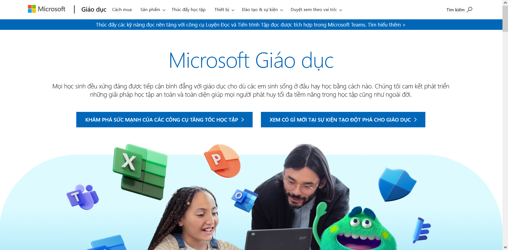

## Tản mạn về Mail sinh viên

_Trước khi đến với câu chuyện về Điện toán đám mây và DevOps, chúc mừng các bạn đã hoàn thành mục tiêu đậu vào trường Đại học mà mình mong muốn. Nhìn mấy bạn chạy đôn chạy đáo đi nộp hồ sơ nhập học, tôi lại bồi hồi nhớ về hình ảnh của chính bản thân cách đây bốn năm trước, khi tôi cũng trúng tuyển vào ngành Công nghệ thông tin của **Khoa học Tự nhiên - ĐHQG TPHCM**. Giờ đây tôi đã chuẩn bị tốt nghiệp, và đang truyền lại những gì đặc biệt nhất cho các bạn tân sinh viên._

_Chắc hẳn các bạn đã nghe qua về cụm từ Mail sinh viên rồi. Ừ, thì nó là một chiếc thư điện tử, được các trường cấp cho mỗi bạn để liên lạc với các phòng ban cũng như người khác. Tất nhiên, nếu các bạn chỉ đọc tới đây mà cảm thấy chán nản bỏ đi thì **các bạn đã sai lầm**. Bởi có nhiều thứ mà có thể bạn sẽ chưa biết về công năng của chiếc mail sinh viên quyền lực này. **Are you ready? Let's check it out!**_

:::note Lưu ý
Các bạn có thể chọn vào tiêu đề mục này để xem những ưu đãi sẵn có của các sản phẩm.
:::

### [GitHub](https://education.github.com/pack)

_Với các bạn sinh viên học Công nghệ thông tin, rất nhiều bạn sẽ cần biết đến **GitHub** - một trong những nơi lưu trữ mã nguồn có thể gọi là lớn nhất thế giới do Microsoft vận hành. Chính vì thế, với việc sử dụng email sinh viên, không chỉ các bạn được nâng cấp miễn phí lên **gói Pro** với nhiều tính năng nâng cao, mà với chương trình **Gói hỗ trợ cho Sinh viên**, các bạn có thể sử dụng **miễn phí hàng chục dịch vụ khác nhau** với những công năng khác nhau._

### [Microsoft](https://www.microsoft.com/vi-vn/education) và [Google](https://edu.google.com/)

_Thường thì mail sinh viên sẽ gắn với một trong hai ông lớn công nghệ này. Với Microsoft, các bạn có thể sử dụng miễn phí **Microsoft 365** - một bộ ứng dụng văn phòng với nhiều tính năng hữu ích, đặc biệt có thể kích họat được Office cùng OneDrive với dung lượng đến **1TB** mỗi người (**1 Terabyte = 1024 Gigabytes**). Còn với Google, các bạn có thể sử dụng miễn phí **Google Workspace for Education** - một bộ ứng dụng tương tự như Microsoft 365, với Google Drive dung lượng **100TB** được chia lại cho tất cả mọi người. Nghe đâu Microsoft cũng đang muốn bắt chước Google làm điều tương tự (**là dùng 100TB chia đều cho mọi người**) thì phải._

:::warning

Thông tin về việc giới hạn dung lượng của Microsoft đối với các giấy phép dành cho Giáo dục đã chính thức được công bố tại **[đây](https://www.microsoft.com/vi-vn/education/products/microsoft-365-storage-options)**

:::

### [Canva](https://www.canva.com/vi_vn/giao-duc/hoc-vien/)

_Canva là một công cụ thiết kế đồ họa trực tuyến, với nhiều mẫu thiết kế sẵn có, giúp các bạn có thể tạo ra những thiết kế đẹp mắt một cách nhanh chóng. Các bạn có thể sử dụng miễn phí gói **Canva Pro (bản Edu)** với nhiều tính năng hữu ích trong vòng **1 năm** chỉ bằng việc sử dụng mail sinh viên. À mà cái này nên để dành cho năm cuối Đại học, khi muốn làm các học phần Tốt nghiêp rồi hẳn dùng cũng chưa muộn màng đâu._

:::warning

Thông tin về việc hủy gói Canva Pro dành cho sinh viên đang được cập nhật và sẽ được chuyển đến tại đây trong thời gian sớm nhất.

:::

### [Autodesk](https://www.autodesk.com/education/edu-software/overview)

_Nếu ai có duyên với những ngành như thiết kế kỹ thuật và lập trình này nọ, **AutoCAD** sẽ là một người bạn thân quen. Nếu sử dụng mail sinh viên, thì dịch vụ AutoCAD cùng hàng loạt dịch vụ khác của Autodesk cũng sẽ được cung cấp cho các bạn sinh viên **miễn phí**... (**à mà cái này thì mình cũng chả dùng bao giờ, nên nhờ các bạn kiểm chứng xem nó ưu đãi tại đâu nhé :>**)_

### [Bitbucket](https://bitbucket.org/product/education)

_Một kho lưu trữ mã nguồn thứ hai (tương tự với GitHub và một anh bạn khác không được kể ở đây là Gitlab) sẽ được cung cấp cho sinh viên miễn phí, với những tính năng như **không giới hạn số lượng kho lưu trữ riêng tư, không giới hạn số thành viên trong hệ thống**, v.v..._

### [Apple (qua UniDays)](https://www.myunidays.com/VN/vi-VN) và [Spotify](https://www.spotify.com/vn-vi/student/)

_Qua **UniDays**, các bạn sinh viên có thể đăng ký **Apple Music** với mức chi phí thấp hơn rất nhiều so với khi sử dụng gói dịch vụ bình thường. Ngoài ra, khi mua **iPad** hay **Macbook**, các bạn cũng sẽ được giảm giá một khoản nhất định. Còn với **Spotify**, các bạn có thể đăng ký gói Premium với mức giá hấp dẫn. **Tất cả chỉ cần một mail sinh viên là đủ**._

### Các dịch vụ khác

- _**[Adobe Creative Cloud](https://www.adobe.com/vn_vi/creativecloud/buy/students.html)** cung cấp giá cước thấp hơn cho sinh viên, **giảm đến 60%**. Hệ sinh thái Adobe cung cấp các giải pháp về thiết kế đồ họa, đặc biệt là **Photoshop/Lightroom** hay **Premiere Pro**._
- _**[YouTube](https://www.youtube.com/premium)** cũng cung cấp gói Premium dành cho sinh viên với mức giá rẻ hơn (**chỉ từ 49.000 VND/tháng**) dành cho sinh viên._
- _**[Amazon Prime](https://www.amazon.com/Amazon-Student/b?ie=UTF8&node=668781011)** cung cấp **6 tháng dùng thử miễn phí** và mức cước rẻ hơn sau 6 tháng khi sử dụng mail sinh viên để đăng ký dịch vụ này. Đây là dịch vụ giải trí do Amazon cung cấp, tương tự như Netflix. **Dịch vụ này hiện đã dừng hoạt động tại Việt Nam**._
- _**[Tableau](https://www.tableau.com/academic/students)** cung cấp các khóa học chuyên biệt cho những ai có đam mê về ngành **Khoa học dữ liệu**. Đối với sinh viên, một mail sinh viên là đủ cho tất cả sự miễn phí._
- _**[Coursera](https://www.coursera.org/)** cũng cung cấp **mỗi năm 1 khóa học miễn phí** cho các bạn sinh viên khi sử dụng mail sinh viên để đăng ký. Coursera là một nền tảng học trực tuyến, với nhiều khóa học chất lượng dành cho mọi lứa tuổi._

### Tạm kết

_**Có thể vẫn còn đó rất nhiều những dịch vụ miễn phí khác, hoặc những thay đổi về chính sách dùng miễn phí dành cho các bạn sinh viên. Tuy vậy, với quyền năng khủng khiếp của mình, mail sinh viên chắc chắn sẽ là người bạn đồng hành không thể thiếu của các bạn sinh viên trên chuyến hành trình thanh xuân của mình...**_

:::info À khoan, còn chưa hết đâu!
_Cơ mà, nếu mà mọi người có để ý ở GitHub thì bên trong Gói hỗ trợ dành cho sinh viên cũng có 1 đầu mục chuyên biệt về chủ đề **DevOps** - chủ đề sẽ được nhắc tới trong phần 2 của bài viết này. "**DevOps là gì?**" - Câu trả lời sẽ có ở tab tiếp theo nhé!!!_
:::
