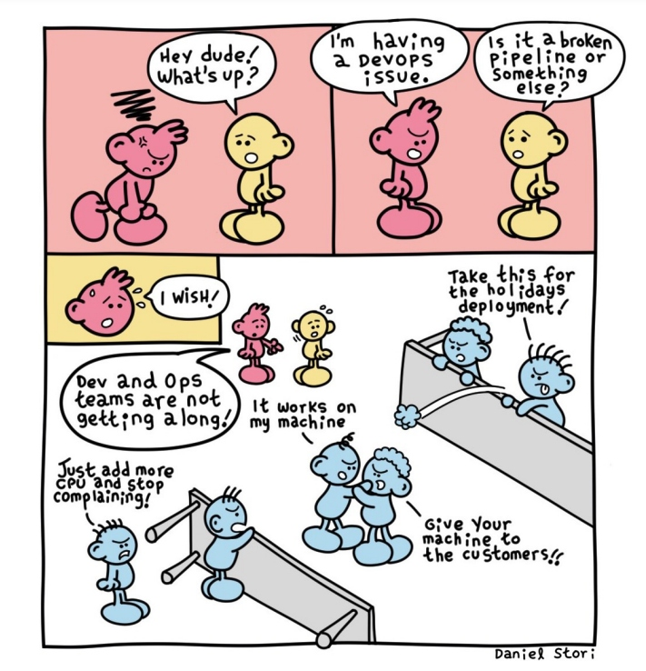
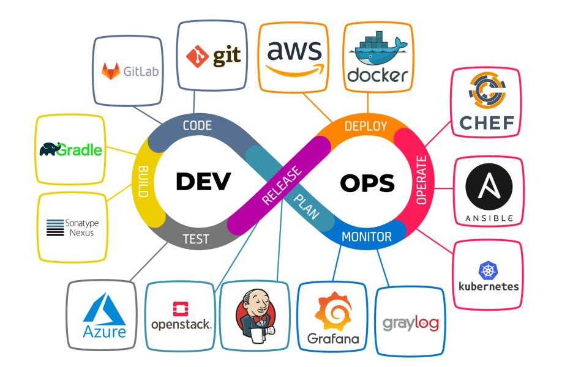
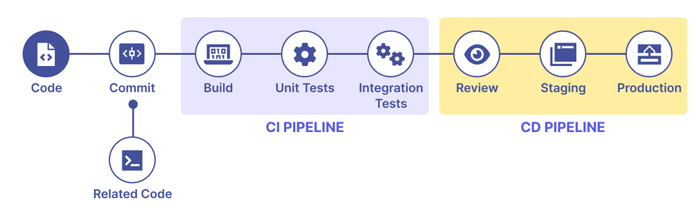
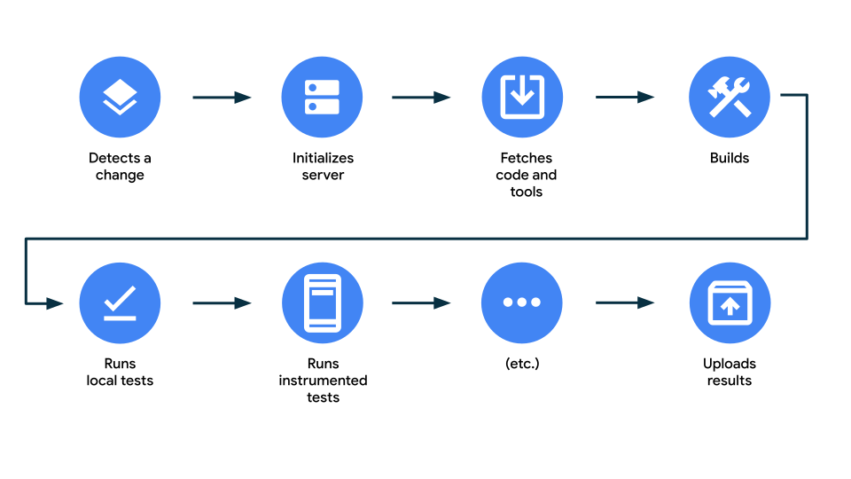
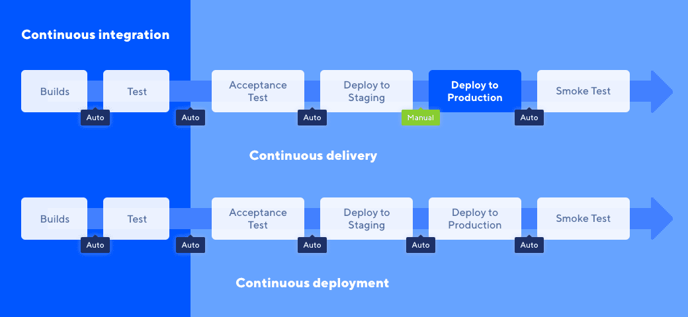

## Chuyện nhà DevOps

_Như vậy là rất lâu sau phần 1 thì phần 2 của **Câu chuyện Cloud** cũng đã được ra mắt. Trong phần 1, chúng ta đã cùng nhau tìm hiểu về những ưu đãi mà mail sinh viên có thể mang lại cho chúng ta. Tuy vậy, chúng ta vẫn chưa đi vào chủ đề DevOps - chủ đề chính của bài viết này. **Vậy DevOps là gì? Cùng tìm hiểu nhé!**_

### Cuộc tranh cãi không hồi kết...

_Trong một công ty về Công nghệ thông tin (CNTT), luôn luôn sẽ có ít nhất hai thành phần nhân sự quan trọng cho một dự án hàng triệu đô la được một khách hàng đẹp trai giao khoán. Một là những **lập trình viên (Developer)**_ 👨‍💻 _, hay còn được biết đến với cái tên dân dã hơn là **Coder**, những người viết mã nguồn cho những chương trình quan trọng. Hai là những **quản trị viên (Operator)**_ 🖥 _, những người quản lý hệ thống, cài đặt, bảo trì, và đảm bảo chương trình luôn hoạt động ổn định. Hai nhóm này luôn luôn có những mâu thuẫn với nhau, và tất cả đều bắt đầu từ một từ khóa là **NGỘ NHẬN (Assumption)**._

> Nguồn: [Dzone](https://dzone.com/articles/dev-vs-ops-conflicted-so-are-we)

_Những tay Dev thì luôn cho rằng, mã nguồn của mình chạy được ở máy mình, **nhất định sẽ chạy được ở tất cả máy khác** (**codebase giống nhau, hạ tầng như nhau thì chạy như nhau**). Những tay Ops thì lại cho rằng, những ứng dụng nào chạy được trên hệ thống của mình sẽ **tương đương vỡi những ứng dụng khác, đồng nghĩa là chạy được trên mọi hệ thống mà mình quản lý**. Thế là, Dev đổ lỗi Ops, Ops lại xoay sang xỉa mắng Dev. Kết cục của những trận cãi nhau không hồi kết đó là:_

> _Vào một ngày đẹp trời, ông khách hàng đẹp trai hôm trước thì hôm nay mặt đã đỏ bừng lên, đùng đùng đi ra khỏi phòng họp, tuyên bố mạnh miệng:_
>
> **_Tôi không cần biết lỗi là của ai, tôi chỉ cần biết là tôi không thể sử dụng được ứng dụng của các ông nữa. Ngưng hợp tác, trả tiền hoặc tôi sẽ kiện ra tòa!_** 💵

_Và rồi, những Dev và Ops lại tiếp tục cãi nhau mà không biết rằng, công ty đứng trước nguy cơ phá sản với **chiếc hợp đồng bị hủy trị giá hàng triệu đô la**, đồng nghĩa là nhiều người sẽ lại **thất nghiệp để đi chạy Grab hay Be**..._

### Nhịp cầu nối những bờ vui...

_Để tránh những nguy cơ có thể xảy ra, sếp tổng đã vào cuộc. Sếp nhấc máy gọi ngay phòng Nhân sự, thuê gấp 1 người có danh xưng là **Kỹ sư DevOps** về để giải quyết vấn đề. Ông DevOps sau **3 vòng phỏng vấn hại não kéo dài gần 3 tiếng hơn**_ 🧠 _cũng được vào làm. Ngay ngày đầu tiên bắt đầu công việc, những Dev và Ops cũ nhìn người mới này với ánh mắt vô cùng trầm trồ và không ngừng thắc mắc:_

> **_Bằng cách quái dị nào mà người này vừa lập trình giỏi vừa vận hành tốt thế?_**

_Thắc mắc này cũng được hỏi ngay trong bữa ăn trưa đầu tiên của mọi người. Ông nhân viên mới ngồi lại cùng với những Dev và Ops, rồi bắt đầu giải thích:_

> _Tất cả mọi chuyện đều là tự ngộ nhận mà ra thì có..._ **_Dev chắc viết mã nguồn cho một mình dùng thôi à? Còn Ops, hệ thống có tính đến việc ứng dụng mới ra mắt sẽ vận hành được trên đó chứ?_**

_Mọi người lặng thinh, không một lời bình luận nào. Ông DevOps tiếp tục:_

> _Thứ tôi đang làm sẽ giúp mọi người bớt ngộ nhận lại._ **_DevOps là viết tắt của hai từ: Development và Operations. DevOps là một phương pháp quản lý, vận hành, và phát triển ứng dụng, nhằm tạo ra một quy trình làm việc liên tục, linh hoạt, và hiệu quả giữa mọi người với nhau. DevOps không phải là một công nghệ, mà là một triết lý làm việc._**

> Nguồn: [Linkedin](https://www.linkedin.com/pulse/devops-tools-rupesh-ranawre/)

♾ _Ông DevOps cầm một chiếc bút, vẽ một dấu vô cực trên tờ giấy mà ông lấy ra từ chiếc ba lô mang theo khi đi ăn (**nghe vô tri dữ**), rồi mô tả với sự hăng say:_

> _Quy trình này có nhiều bước, cũng như bình thường mọi người hay làm thôi_: **_Plan, Code, Build, Test, Release, Deploy, Operate, Monitor_**. _Trong đó, thường là mấy ông Dev sẽ quan tâm nhánh trái của dấu vô cực này, tức là tới Release là cùng thôi. Ops sẽ quan tâm những phần còn lại. Bây giờ tôi sẽ kết nối hai nhánh này lại với nhau, để mọi người có thể làm việc cùng nhau._

_Ông DevOps vẽ thêm một khung hình chữ nhật, rồi chốt lại:_

> _Nói thật, tôi còn có thể giúp mọi người làm được nhiều hơn là kết nối hai bên lại với nhau. Bởi còn có một thuật ngữ khác còn lớn hơn cả DevOps là **DevSecOps - tức là bảo vệ (Security) an toàn cho ứng dụng triển khai qua DevOps**._ 🔒

_Mọi người ngớ ra, có vẻ vẫn chưa hiểu **mình đang nghe được cái gì nữa**. Sau khi ăn xong, mọi người vừa trò chuyện rôm rả vừa trở về tiếp tục công việc mà không còn những trận cãi nhau._

_Còn về vị khách hàng kia, sau khi được sếp tổng giải thích kỹ lưỡng về tình hình cũng đã nguôi ngoai mà không kiện công ty ra tòa và hẹn lại dịp khác. Người này chừng một tháng sau quay lại nhận sản phẩm cũng đã không còn cảm thấy khó chịu nữa mà thay vào đó, người này quyết định **rủ thêm các đối tác khác của mình đến tham quan và hợp tác với công ty để phát triển sản phẩm**. Công ty cũng đã không còn phải lo lắng về việc phá sản nữa mà thay vào đó, đã có thêm nhiều dự án mới để phát triển._

### Những điều cần biết về DevOps và CI/CD

_Quay trở lại với chiếc dấu vô cực phía trên, xương sống của DevOps là **CI/CD (Tích hợp và Phát triển liên tục) và Tự động hóa**. Bởi khi quá trình dựng và triển khai ứng dụng đều được tự động hóa và diễn ra liên tục, sẽ có nhiều lợi ích đem lại._

> Nguồn: [Katalon](https://katalon.com/resources-center/blog/ci-cd-introduction)

#### Dựng tự động

✅ _Dựng ứng dụng tự động sẽ mang đến **năm lợi ích chính**:_

1. **Nhanh chóng**. _Việc dựng tự động sẽ đạt tốc độ cao hơn so với việc gõ lệnh dựng bằng tay._
2. **Ổn định**. _Quá trình dựng diễn ra thống nhất theo các bước đã được lập trình sẵn, không bị nhầm lẫn._
3. **Lặp lại**. _Quá trình dựng được lặp lại nhiều lần, không bị thay đổi. Điều này giúp mã nguồn có thể dựng được nhiều phiên bản khác nhau nhưng vẫn cho kết quả như nhau._
4. **Gọn gàng**. _Quá trình dựng được thực hiện giống nhau trên mọi máy tính, không cần phải cài đặt thêm các phần mềm khác._
5. **Tin cậy**. _Quá trình dựng được thực hiện theo một quy trình ít lỗi nhất có thể._

#### Tích hợp liên tục (CI)

> Nguồn: [Android Developers](https://developer.android.com/training/testing/continuous-integration)

_Đây là dạng thực hành cho phép nhập các thay đổi mã nguồn từ các lập trình viên vào một kho mã nguồn chung. Quá trình này sẽ được thực hiện liên tục, **thường là mỗi khi có thay đổi mã nguồn mới**. Quá trình này sẽ giúp cho các lập trình viên có thể kiểm tra mã nguồn của mình có bị lỗi hay không, và có thể sửa chữa ngay lập tức. **Các hệ thống kiểm thử tự động** sẽ được kích hoạt để kiểm tra mã nguồn mới này, và thông báo kết quả cho lập trình viên._

✅ _**Năm lợi ích chính** cũng được chỉ ra_:

1. **Phát hiện lỗi sớm**. _Các lỗi sẽ được phát hiện sớm, giúp cho việc sửa chữa dễ dàng hơn._
2. **Giảm gánh nặng nhập mã nguồn**. _Các lập trình viên không cần phải nhập mã nguồn thủ công với lượng lớn, thay vào đó sẽ nhập dần dần vào kho chung._
3. **Tăng tốc độ phát triển**. _Các lập trình viên có thể nhập mã nguồn nhanh hơn, đồng nghĩa với việc ứng dụng luôn ở trạng thái sẵn sàng ra mắt phiên bản mới với người dùng._
4. **Cho phép kiểm thử liên tục**. _Các hệ thống kiểm thử tự động sẽ được kích hoạt liên tục, cùng với các kỹ sư kiểm thử luôn trong trạng thái sẵn sàng, sẽ cho phép việc kiểm thử diễn ra ngay tại thời điểm ứng dụng chuẩn bị ra mắt phiên bản mới._
5. **Khuyến khích lập trình thông minh**. _Các lập trình viên sẽ được khuyến khích lập trình thông minh hơn, tối ưu mã nguồn sao cho đơn giản và dễ dàng theo dõi, điều chỉnh khi cần._

#### Phát triển liên tục (CD)

> Nguồn: [Katalon](https://katalon.com/resources-center/blog/continuous-delivery-vs-continuous-deployment)

_**Phát triển liên tục** là một thuật ngữ tiếng Việt để gọi chung cho hai thuật ngữ tiếng Anh tuy giống nhau nhưng lại khác nhau: **Continuous Delivery** và **Continuous Deployment**. Hai thuật ngữ này có một điểm chung là đều có chữ "**liên tục**" (**Continuous**) trong đó, nhưng lại có một điểm khác biệt là "**Delivery**" và "**Deployment**"._

_**Liên tục**, nghĩa là mã nguồn phải trải qua một quá trình kiểm thử diễn ra **liên tục và tự động** với các bài kiểm tra khác nhau nhằm đảm bảo ứng dụng có thể vận hành ổn định dưới mọi điều kiện. Sự khác biệt giữa hai từ khoá còn lại nằm ở chỗ: **Delivery** cũng giống như **người giao hàng**_ 📦 _, vẫn phải làm trung gian để sản phẩm có thể được vận chuyển tận tay đến người dùng. Ngược lại, **Deployment loại bỏ hoàn toàn sự có mặt của người giao hàng** mà thay bằng những chú **robot được lập trình sẵn**_ 🤖 _, chỉ cần bỏ hàng vào sau lưng robot, robot sẽ tự động xác định được địa chỉ và giao trực tiếp hàng hóa đến tay người dùng._

### Tạm kết

_**So that's it**. Rõ ràng là khi mọi thứ trở nên tự động hóa thì xem ra còn tốt hơn là phải ngồi lì hàng tiếng đồng hồ **chỉ để đi giải quyết bằng tay** những vấn đề vô bổ. Các lập trình viên và quản trị viên bây giờ cũng chỉ còn là những danh xưng, bởi lẽ bây giờ hầu như đã phải nhường chỗ cho những thế hệ mới: **Thế hệ kỹ sư DevOps thống trị ngành CNTT**. Nếu ai đó đam mê Trí tuệ nhân tạo và Học máy thì phiên bản phái sinh là **MLOps** cũng là một trong những thế hệ sẽ làm chủ trong thời gian tới. **Cơ mà khoan đã...** Nếu ai đó đang thắc mắc tại sao tên bài là **Câu chuyện Cloud** mà chưa nhắc gì tới Cloud là sao thì **xin hãy đợi phần 3** của bài viết này trong những ngày tới để biết câu trả lời, còn bây giờ thì **tôi đi chuẩn bị họp với mấy anh em DevOps trên công ty đây, bye bye!**_ 👋
