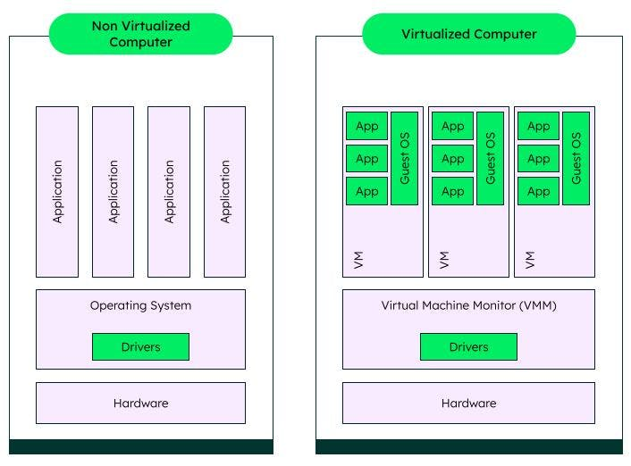
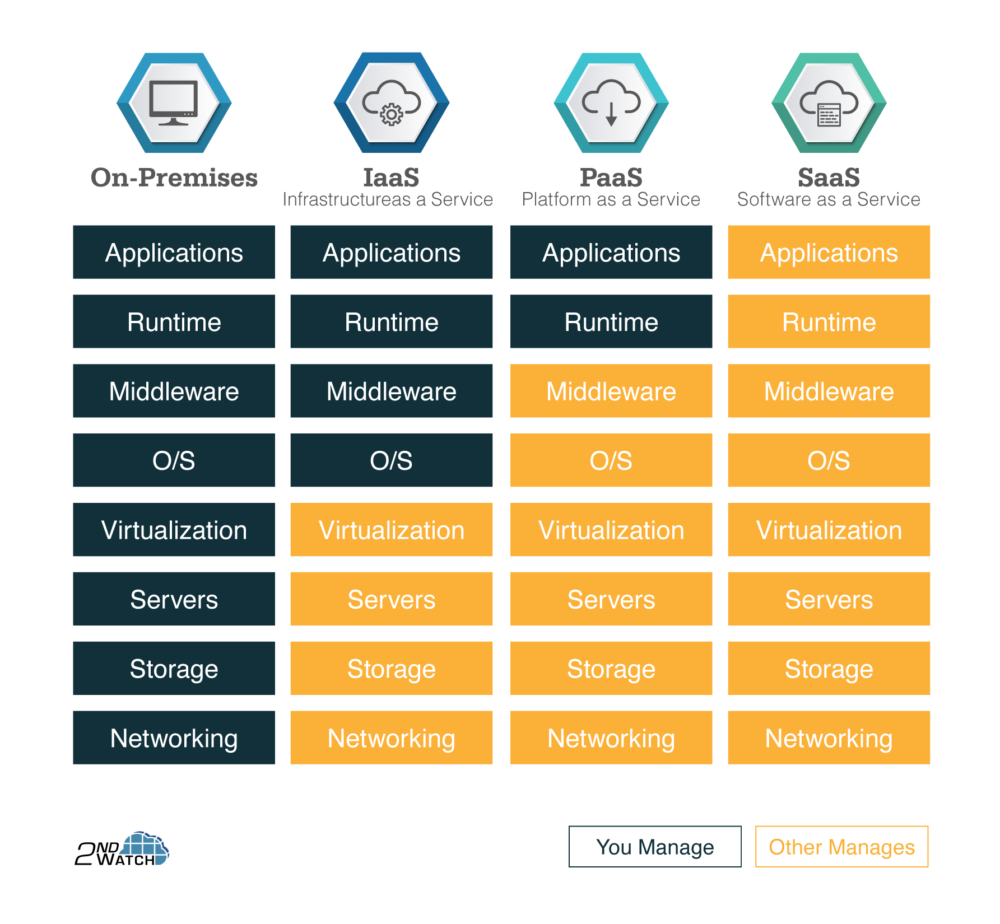
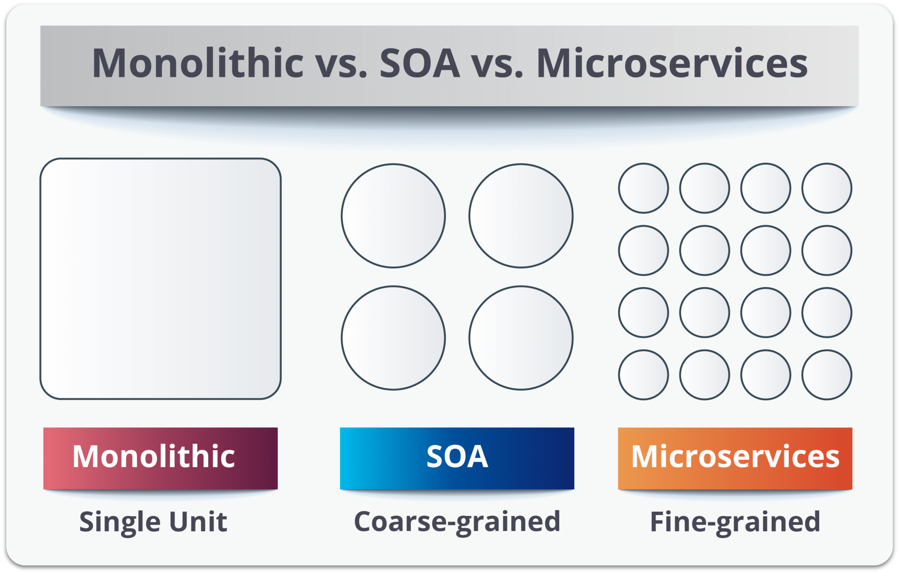
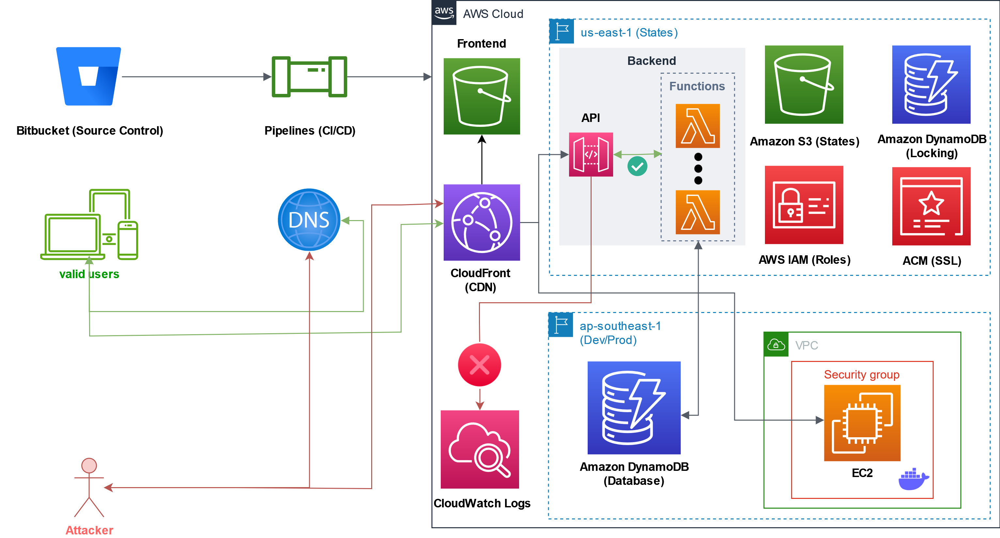
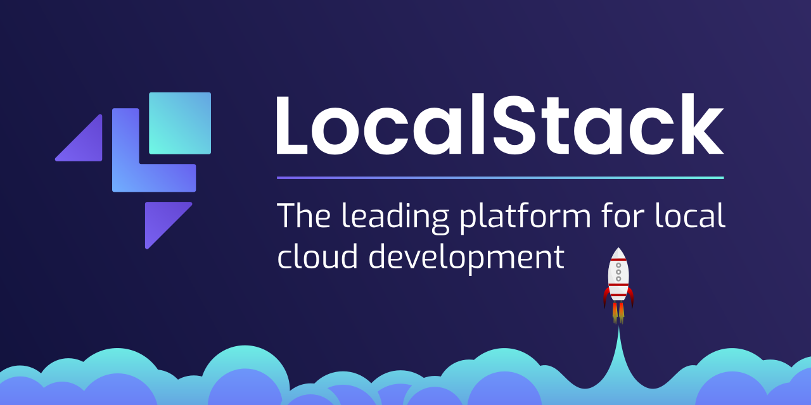

## Chuyện Khóa luận 📚

_Phù, cuối cùng cũng viết được đến phần cuối cùng của **Tech Blog** này, hy vọng mọi người đọc xong sẽ không thấy chán._ 😂

_Ngày hôm nay tôi sẽ kể mọi người nghe về những gì mà Khóa luận tốt nghiệp Đại học đã thực hiện, cũng như bàn sâu hơn về kiến trúc điển hình của một ứng dụng chạy trên Cloud là như thế nào. Nhưng trước hết, giải đáp câu hỏi: **Điện toán đám mây là gì?**_

### Mở đầu

_Chắc nhiều người sẽ nghe đến những thuật ngữ máy tính như **CPU, RAM, Ổ cứng, ...** Thế thì câu hỏi đầu tiên là: **Dùng cách nào là tối ưu nhất cho máy tính của mình?** Câu trả lời sẽ làm độc giả ngả ngửa: **Dùng hết!!!**_ 😂

_Giống như một đĩa thức ăn, bạn ăn không hết thì tức là bạn đang **lãng phí thức ăn**. Máy tính chả khác gì đĩa thức ăn đó cả. Để tối ưu hóa việc sử dụng tài nguyên, người ta đã nghĩ ra một cách làm đó là **Chia sẻ tài nguyên**. Từ đây, định nghĩa về việc tạo ra những **máy tính ảo (Virtual Machine)** đã ra đời._ 💻

_Máy tính ảo (**máy ảo**) là một máy tính được tạo ra bằng phần mềm, nó có thể chạy như một máy tính thật với các hệ điều hành khác nhau. Máy ảo được tạo ra bằng cách **phân lập và chia sẻ tài nguyên của một máy tính thật**. Điều này cũng có nghĩa là một máy tính thật có thể chạy nhiều máy ảo khác nhau, mỗi máy ảo sẽ có cấu hình khác nhau, phù hợp với nhu cầu sử dụng của người dùng. Đây là cách tối ưu tốt nhất dành cho việc phát triển và thử nghiệm ứng dụng chạy trên nhiều nền tảng khác nhau._

> Nguồn: [MongoDB](https://www.mongodb.com/cloud-explained/virtual-machines)

_Nhìn chung, ảo hóa có nhiều loại khác nhau, nhưng chúng ta sẽ không đi sâu vào câu chuyện này. Các bạn có thể tìm hiểu thêm tại [đây](https://www.vmware.com/topics/glossary/content/virtual-machine) để nắm được nhiều hơn về ảo hóa._

_Tất nhiên là gì, nếu mà các bạn có thể làm được việc tạo máy ảo trên máy tính của mình thì nhiều ông lớn công nghệ cũng làm được điều tương tự. Câu hỏi thứ hai xuất hiện: **Làm sao để kiếm tiền từ việc này?** Câu trả lời đơn giản là: **Bán tài nguyên**. Họ làm việc này bằng cách: **Phát triển hẳn một hệ thống phân lập và chia sẻ tài nguyên cho người dùng trên khắp thế giới, và thu tiền từ việc cho thuê tài nguyên đó**. Đây là nơi người ta lợi dụng thứ mà trong Triết học hay gọi là **Giá trị thặng dư** sinh ra từ việc tối ưu hóa hệ thống để làm giàu cho chính mình. Mô hình cho thuê này, được gọi là **Điện toán đám mây (Cloud Computing)**._

> Nguồn: [Atlassian](https://www.atlassian.com/microservices/cloud-computing)

_Điện toán đám mây, theo định nghĩa quốc tế, là một mô hình cho phép cấp quyền truy cập đến kho chung chứa các tài nguyên máy tính có thể cấu hình được như máy chủ, bộ nhớ lưu trữ, mạng, ứng dụng, dịch vụ theo yêu cầu một cách **tiện lợi, nhanh chóng, an toàn, mọi lúc mọi nơi**._

_Lợi ích của điện toán đám mây là vô cùng lớn, bên cạnh vấn đề về **phụ thuộc nguồn cung, chi phí vận hành và bảo vệ dữ liệu cá nhân**, cụ thể là:_

- _Việc **triển khai diễn ra nhanh chóng**, giúp **giảm sự phức tạp tại người dùng** trong thiết lập tài nguyên cũng như **đơn giản hóa việc quản trị thiết bị**._
- _Triển khai dịch vụ trên nền điện toán đám mây có thể **giảm chi phí quản trị thiết bị**, cũng như giúp người dùng **linh hoạt trong truy cập cũng như điều chỉnh quy mô** ứng dụng._
- _Điện toán đám mây cung cấp môi trường phát triển và kiểm thử phần mềm với tính **khả dụng và ổn định cao**, giúp **tăng tính cộng tác** trong chia sẻ tài nguyên._

### Một số mô hình thường gặp

_Có rất nhiều mô hình cho thuê tài nguyên trên nền tảng điện toán đám mây, nhưng chúng ta sẽ chỉ nói về ba kiểu mô hình phổ biến nhất: **Infrastructure as a Service (IaaS)**, **Platform as a Service (PaaS)** và **Software as a Service (SaaS)**._

**_Sự khác nhau của ba mô hình có thể được phân tích như hình dưới đây._**

> Nguồn: [2ndWatch](https://www.2ndwatch.com/blog/back-to-the-basics-the-3-cloud-computing-service-delivery-models/)

- _**Cơ sở hạ tầng dưới dạng dịch vụ (IaaS)** sẽ bao gồm các dịch vụ được nhà cung cấp dịch vụ cung cấp cho người dùng như: **Hạ tầng mạng, bộ nhớ cũng như các hệ thống tài nguyên máy tính khác**. Người dùng tự do quản lý các phần còn lại bao gồm: **Hệ điều hành, bộ khuôn lập trình, cơ sở dữ liệu cũng như ứng dụng và một số hạ tầng mạng như tường lửa**._
- _Đối với **Nền tảng dưới dạng dịch vụ (PaaS)**, **ngoại trừ phần ứng dụng và cấu hình môi trường được người dùng quản lý**, toàn bộ các phần còn lại đều được nhà cung cấp dịch vụ quản lý như: bộ nhớ, cơ sở dữ liệu, hạ tầng mạng, hệ thống tài nguyên máy tính và bộ khuôn lập trình..._
- _Phiên bản nâng cấp nhất chính là **Phần mềm dưới dạng dịch vụ (SaaS)**, nơi mà ở đó người dùng sẽ **không cần quản lý bất kỳ nguồn tài nguyên gì**, bởi hầu hết tất cả đều được nhà cung cấp dịch vụ mang đến. Đây là một mô hình có thể nói là toàn diện nhất mà điện toán đám mây có thể đem lại._

### Một số hướng triển khai ứng dụng

_Để nói về hướng triển khai 1 ứng dụng, từ trước đến nay người ta sẽ thường nói đến một thứ kiến trúc tạm gọi là **Kiến trúc đơn nhất (Monolithic)**. Kiến trúc này có một đặc trưng là triển khai dễ dàng, tất cả trong một và dễ dàng kiểm thử hơn. Nhưng cái gì cũng có bất lợi của nó - kiến trúc này có điểm nghẽn về **nâng cấp và ổn định hạ tầng**, nghĩa là việc nâng cấp và khắc phục sự cố luôn luôn là phải thực hiện trên toàn bộ hệ thống, dù có thể chỉ một vài bộ phận trong hệ thống thực sự có vấn đề. Điều này dẫn đến việc tốn kém về chi phí và thời gian thực hiện._

_Dể khắc phục những sai lầm chết người này, người ta bắt đầu tiến đến việc chia tách các thành phần của ứng dụng. **Kiến trúc hướng dịch vụ (SOA)** và **kiến trúc dịch vụ con (Microservices)** cũng từ đây mà ra đời. Dẫu có chi phí và thời gian triển khai ở giai đoạn đầu lớn hơn nhưng bù lại là sự dễ dàng trong việc nâng cấp và khắc phục sự cố phát sinh._

**_Tấm hình sau cho mọi người thấy được những sự khác nhau cơ bản của cả ba mô hình._**

> Nguồn: [Dzone](https://dzone.com/articles/microservices-vs-soa-whats-the-difference)

### Các nhà cung cấp dịch vụ

_Có một số dạng mô hình đám mây được sử dụng trong thực tế. Có thể phân loại như sau:_

- _**Đám mây công cộng (Public Cloud)**: Đây là một mô hình điện toán đám mây mà người cung cấp dịch vụ sẽ cung cấp tài nguyên cho người dùng thông qua Internet. Các ví dụ điển hình như: **Amazon Web Services (AWS), Microsoft Azure, Google Cloud Platform (GCP), ...**_
- _**Đám mây riêng (Private Cloud)**: Đây là một mô hình điện toán đám mây mà người cung cấp dịch vụ sẽ cung cấp tài nguyên cho người dùng thông qua một mạng riêng ảo (VPN). Các ví dụ điển hình như: **VMware, OpenStack, ...**_
- _**Đám mây hỗn hợp (Hybrid Cloud)**: Đây là một mô hình điện toán đám mây mà người cung cấp dịch vụ sẽ cung cấp tài nguyên cho người dùng thông qua cả Internet và mạng riêng ảo (VPN). Ví dụ điển hình là **IBM Cloud, ...**_

_Đối với chiếc ứng dụng mà tôi thực hiện trong Khóa luận tốt nghiệp, việc sử dụng một mô hình **điện toán đám mây công cộng** là **Amazon Web Services (AWS)** đã được ưu tiên với rất nhiều dịch vụ hỗ trợ. Đây là một trong những nhà cung cấp dịch vụ điện toán đám mây lớn nhất thế giới hiện nay. **Mô hình ứng dụng đã được chuẩn hóa như hình dưới đây.**_

_Giải thích cho mô hình này đòi hỏi nhiều thời gian và công sức, nên mời mọi người sẽ theo dõi chi tiết trong Khóa luận tốt nghiệp của tôi thông qua [**video này**](https://www.youtube.com/watch?v=KZvgwFtlJek)._ 😂

_Còn đối với website chính thức này, gần như tôi chỉ cần một máy chủ cơ sở dữ liệu cho một số dịch vụ của mình, còn lại không chạy bất kỳ máy chủ nào từ giao diện (Frontend) đến xử lý (Backend) nhờ vào cơ chế tương tự như trong Khóa luận được gọi là **hàm thực thi phi máy chủ** (đã từng được đề cập trong **Tech Blog số 1 - Cập nhật về Youtube Downloader**, phần **Hậu sự kiện**)._

### Thử nghiệm không mất phí

_AWS là một nhà cung cấp lớn đến từ Mỹ, mà mọi người biết rồi đó, nhắc tới Mỹ là nhắc tới **tiền**. Vốn thì tôi sử dụng gói cước miễn phí một năm của AWS mang đến Khóa luận lần đó, nhưng liệu **nhiều năm sau nó còn miễn phí hoàn toàn hay không? Khả năng cao là không!!!**_ 🤣

_Nếu ai đó đang nghĩ đến giải pháp tương tác ít tốn kém (**hoặc không luôn thì càng tốt**) thì **LocalStack** là lựa chọn hàng đầu._

> Nguồn: [LocalStack](https://localstack.cloud/)

_Với LocalStack, hàng loạt các dịch vụ hàng đầu được AWS cung cấp sẽ được mô phỏng lại trên máy tính của mình, thông qua một chiếc container Docker. Các dịch vụ này có thể sử dụng được trên **môi trường phát triển**, hoặc thậm chí là đẩy thẳng lên AWS để trở thành **môi trường vận hành chính thức**. Đây là một giải pháp tuyệt vời cho những ai muốn tìm hiểu về AWS mà không muốn đắn đo về việc phải mất bao nhiêu tiền cho việc thử nghiệm, rồi chọn dịch vụ nào để thử..._

_Trước đó tôi cũng từng thử thằng này, nhưng ở giai đoạn đầu LocalStack vẫn chưa tích hợp nhiều tính năng và dịch vụ như kỳ vọng, nên chỉ dừng lại ở việc xem thử một số dịch vụ khả dụng. Giờ đây, LocalStack còn có thêm cả **trình duyệt dịch vụ tích hợp**, đáp ứng tốt hơn nhu cầu theo dõi của đa số người dùng._

_Tất cả mọi thứ đều được mô phỏng lại trên máy tính của mình, nên việc sử dụng LocalStack cũng không khác gì việc sử dụng AWS là mấy. Mọi người có thể tham khảo thêm tại [**đây**](https://docs.localstack.cloud/overview/) để biết thêm chi tiết._

### Kết thúc

_So that's it. Người ta nói rằng: **Điện toán đám mây là một cuộc cách mạng, một cuộc cách mạng thật sự về tối ưu máy tính cho tất cả mọi người dùng trên khắp thế giới, và trở thành người tiên phong trong công cuộc chuyển đổi số của nhiều quốc gia, trong đó có Việt Nam**. Việc ứng dụng Điện toán đám mây vào đời sống sẽ là một xu hướng không thể ngăn cản được, và tôi tin rằng nó sẽ là một trong những xu hướng phát triển mạnh mẽ nhất trong tương lai, là trụ đỡ vững chắc nhất cho những mảng công nghệ đang được "**thần thánh hóa**" hiện nay như **Trí tuệ nhân tạo, Dữ liệu lớn và Máy học**..._

_Bên cạnh nắm chắc những kiến thức cơ bản của các chuyên ngành, **Ảo hóa và Điện toán đám mây** sẽ là một phần không thể thiếu trong những kiến thức mà bất kỳ ai có ý muốn theo đuổi **Công nghệ thông tin** cần phải nắm rõ và sử dụng thuần thục. Hy vọng rằng, những chia sẻ này sẽ giúp ích cho mọi người trong việc nắm bắt những kiến thức cơ bản về **Điện toán đám mây**, cũng như giúp mọi người có thêm động lực để tìm hiểu sâu hơn về chủ đề này._
