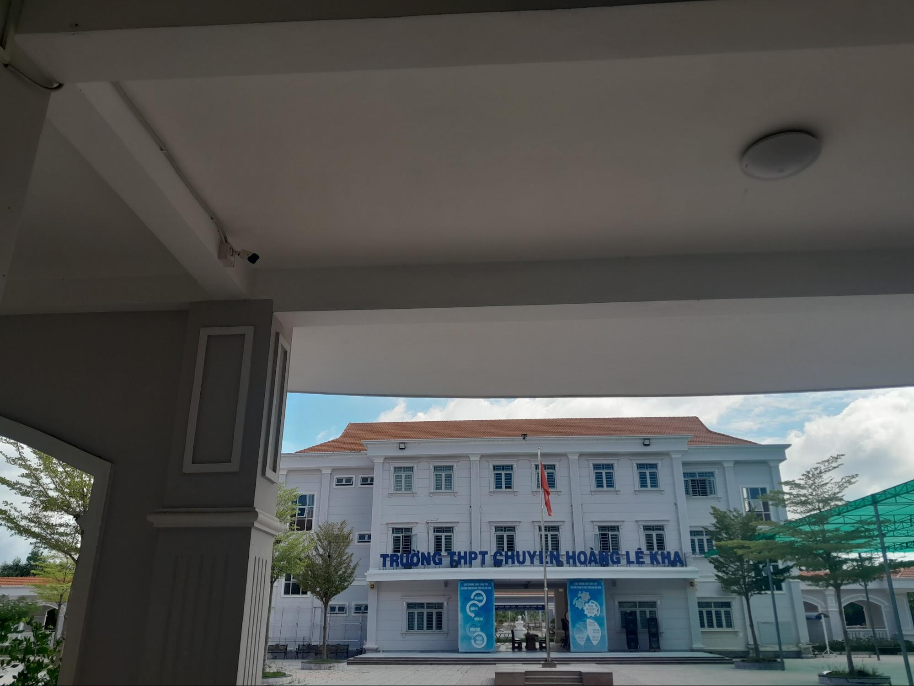

## Kỳ 1: HOÀI NIỆM...

**_Xin chào mọi người, đã lâu không tái ngộ nhỉ?_**

_Một chặng đường đong đầy cảm xúc đã chính thức khép lại. Tuy ban đầu tôi còn tồn tại vài thiếu sót, lắm lúc va phải vô vàn chông gai, nhưng thật may mắn dòng văn của tôi đã nhận được nhiều sự chú ý và ủng hộ từ mọi người. Cảm ơn mọi người vì đã chọn đồng hành cùng tôi suốt một năm qua._

_Sau một thời gian dừng chân, tôi đã có thể quay trở lại và bắt đầu một chặng đường mới. **Vì vậy, chúng ta hãy cùng bước tiếp nhé!**_

**_Này, bạn của tôi ơi, bạn đã sẵn sàng cho chặng đường mới chưa?_**

_Vậy là cột mốc năm hai trong đời sinh viên đã sắp đến rồi đấy, tôi cũng sắp phải trở lại trường, sắp bước vào chuỗi ngày mệt mỏi vô tận bên hàng loạt bài tập, công việc, đính kèm bao nỗi sợ về một tương lai vô định, mông lung. Đương nhiên, tôi vẫn chưa thật sự sẵn sàng vẫy vùng giữa dòng đời bao la._

**_Bất giác, những thước phim tuyệt đẹp về Hoàng chuyên thoáng hiện về trong kí ức của tôi, để tôi được đắm trong nỗi nhớ thương một lần nữa..._**

_Hoàng chuyên sau một thời gian dài "**tĩnh dưỡng**", có lẽ bây giờ cũng đang trở mình thức dậy, sẵn sàng dẫn dắt những chuyến đò mới. Cơ mà trong những chuyến đò ấy đã không còn bóng dáng của tôi nữa rồi._

**_À, tôi đã xa trường hơn một năm rồi đấy nhỉ?_**

_Bây giờ những tân học sinh của trường đã là khóa 30, chỉ cách tôi bốn năm thôi nhưng tôi cảm thấy bản thân đã già đi. Sắp chạm ngưỡng hai mươi xuân xanh rồi đấy, nhưng tâm hồn của tôi cứ mãi ở tuổi niên thiếu, dẫu bị la rầy mãi vẫn không trưởng thành nổi. Nói cách khác, tôi chỉ già về mặt thể xác mà thôi._

_Tôi vẫn âm thầm dõi theo trường, dõi theo những thầy cô và các em ở nơi đây. Cảm giác vui buồn xen lẫn, bởi tôi đã chẳng còn trực tiếp tham gia chuyến tàu thanh xuân này lần nữa, mà chỉ có thể gián tiếp dõi theo..._

_Có lẽ sẽ rất lâu, hoặc là không bao giờ tôi có thể dứt được nỗi nhớ về Hoàng chuyên. Dẫu sao, tôi vẫn mong muốn được viết tiếp những câu chuyện khi ở Hoàng chuyên như một cách để vơi đi niềm tiếc nuối vô hạn trước sự ngăn cản của dịch bệnh, để tâm hồn dần già cỗi này được sống lại với bao hoài bão thuở non nớt..._

**_Năm học này, chúng ta cùng nhau bước tiếp nhé!_**
