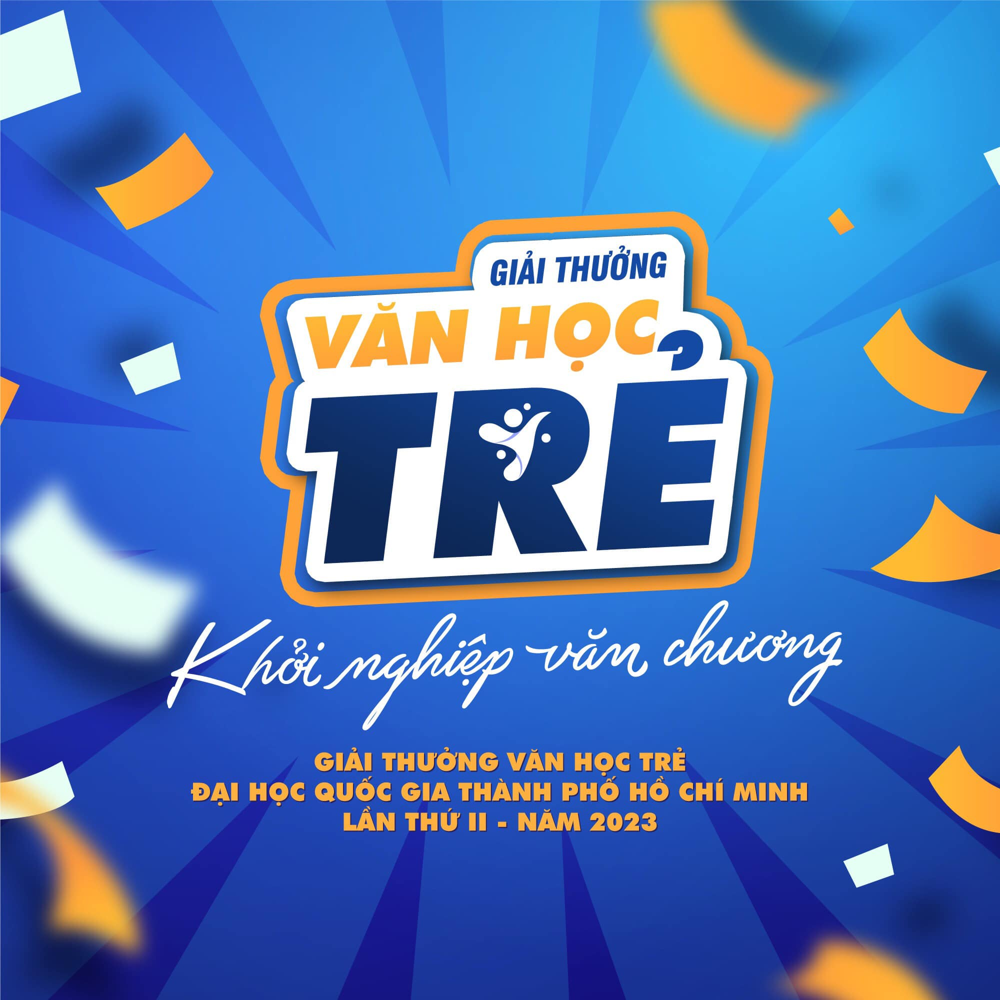

## Kỳ 2: KHÔNG HOÀN HẢO

_Dưới đây là toàn văn bài thơ được tác giả gửi dự thi **[Giải thưởng Văn học trẻ Đại học Quốc gia TP.HCM lần II, năm 2023](https://vanhoctre.vnuhcm.edu.vn/)** ở hạng mục **Thơ**._

> **Nguồn**: [Giải thưởng Văn học trẻ ĐHQG TP.HCM](https://www.facebook.com/vanhoctre.vnuhcm/)

### Không hoàn hảo

_Tôi xuất phát bằng những con số không:_

**_Không nhận diện chính xác một dáng vẻ_**

**_Không nhận thức rõ cả sự tồn tại_**

_Duy chỉ có tiếng oà khóc trong vòng tay mẹ_

_Gửi lời chào một cuộc đời **không hoàn hảo**._

 

_Danh hiệu "**con nhà người ta**" không bao giờ gán tên tôi_

_Tôi chẳng xinh đẹp cũng chẳng học giỏi_

_Thành tích thường xuyên chạm ngưỡng **trung bình**_

_Nhưng sâu thẳm trong trái tim của gia đình_

_Dù nhân gian xoay vần như thế nào_

_Đứa trẻ của họ mãi mãi là **niềm tự hào**_

_Bởi đối với họ, tôi vẫn "**hoàn hảo**" theo một cách rất riêng._

 

_Chuỗi công thức, định luật, phương trình Toán, Lý, Hóa phức tạp_

_**Đã bao giờ nằm gọn trong trái tim cô bé yêu Văn chương?**_

_Nỗi lòng của biết bao thế hệ cầm bút_

_Thắp trong lòng ngọn lửa nồng đượm tình thương_

_Những dòng văn, câu thơ đầu tay dẫu còn vụng_

_Vẫn vang một khúc ca trong trẻo ở mọi nẻo đường_

_Để hồn tôi không bao giờ **mất phương hướng**..._

 

_Tôi không theo đuổi sự hoàn hảo_

**_Vì biển nào mà chẳng có sóng dữ?_**

**_Vì ưu - khuyết có bao giờ mâu thuẫn?_**

**_Vì tôi không chối bỏ chính tôi._**

 

_Xuyên suốt dòng đời mênh mông vô kể_

_Tôi không ngừng thiết lập lại bản thể_

**_Bằng chất liệu của riêng tôi._**

 

_Dù khiếm khuyết luôn luôn hiện hữu_

_Tôi cũng không được phép quên chính mình_

**_Trên chặng đường định hình một giá trị._**
