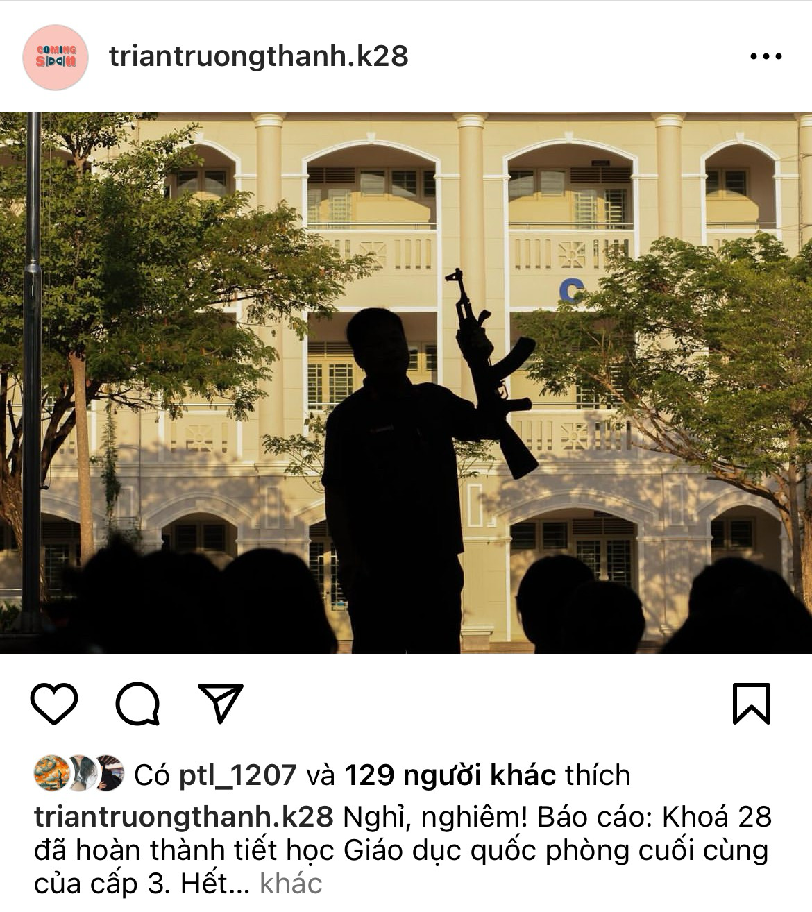
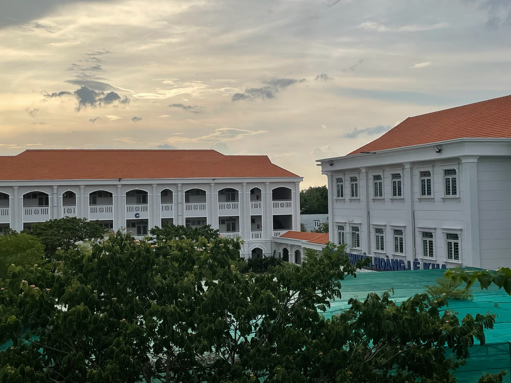

## Kỳ 3: GỬI HOÀNG CHUYÊN CHO MỘT MÙA "NHỚ"...

:::info

_Đây là bài viết được **[Jolie Nguyễn Ngọc Khánh Phương](https://www.facebook.com/profile.php?id=100066615586116)** viết trong **Tháng chuyển đổi nội dung (12/2023)** giữa các đội hình trong The Collab Team._

:::

_Ai trong chúng ta cũng có cho mình cái thời thanh xuân tươi đẹp nhất. Đó có thể gắn với những mối tình tuổi đôi mươi, đó có thể gắn với sự vỡ òa của những giấc mơ biến thành sự thật... hay gắn với ba năm cấp 3 thật đẹp đẽ!!! Nhưng có lẽ sẽ đẹp hơn nếu đó là mục tiêu của mỗi chúng ta ngày tháng cấp 2..._

> **_Khởi đầu là đáng sợ, và kết thúc thì thường là buồn, nhưng đó là những thứ tốt nhất mà bạn có suốt những năm trung học._**

_Vạn sự khởi đầu nan mà, nhưng bước qua cái nan đó lại chính là bến bờ của niềm vui và ước nguyện đạt được!!!_

**_Chúng ta nhớ gì của 3 năm cấp 3 đó?..._**

_Nhớ ngày tháng cấp 2 mà hễ ra đường, thấy anh chị nào đeo dây xanh, dây đỏ, có chữ "**Hoàng Lê Kha**" là về mê mẩn, ước được vào trường, được đeo như thế. **Chắc là ngầu lắm luôn!!!** Rồi cũng vùi đầu vào học để thực hiện ước mơ đó thôi, thức khuya, dậy sớm đủ kiểu, nhiều lúc lăn đùng ra bệnh luôn!!! Nhưng mà kệ, vì **tương lai tươi sáng** mà..._

_Nhớ cái ngày mà cứ suy nghĩ hoài: "**Bữa mình làm được mà không biết nhiêu điểm nữa?**", "**Má ơi, điểm sàn chuyên ABC tới 35 điểm, đậu sao nổi!!! Rớt rồi quá!!!**", hay ngồi khóc chỉ vì sợ..._

_Nhớ lúc mà biết danh sách trúng tuyển, lại nhảy cẩn lên vì sung sướng, mấy đứa bạn lên mạng khoe nhau, nhiều đứa còn gấp đến độ xúng xính đồ đi du lịch liền luôn, như tự thưởng mình. **Lúc đó cứ tự ngồi cười khúc khích mà trong lòng tự hào dữ lắm!!!!**_

_Rồi có nhớ cái chuỗi ngày tháng cấp 3 với đủ thứ kỉ niệm tuổi học trò, lúc mới vào nhận lớp, quen gì nhau đâu, rồi qua hai ba hôm lại tụm với nhau nói chuyện, đi chơi,... ***Nói chung là vui với nhớ lắm!!!***_

_Và rồi... cũng đến cái tuổi mà ta rời xa... "**Tri ân và trưởng thành**"..._

_Chúng ta sẽ chẳng thể sống mãi với một cái gì đó quá lâu, ai rồi cũng phải lớn, cũng phải đi... Đi đến một điểm khác dành cho mình..._

**_Hoàng chuyên luôn đẹp... đẹp ở mỗi mùa... và đẹp khi ta thật sự nhớ về..._**

**_Mùa "nhớ"... có thể là mùa hè ngồi bên đống deadlines dày cộm và muốn mình quay về ngày tháng cấp 3, cũng có thể là mùa xuân, trại về rồi hay lén vào chơi..._**

> **_Nhớ, nhớ lắm, nhớ cái Hoàng chuyên từng có tên mình..._**
