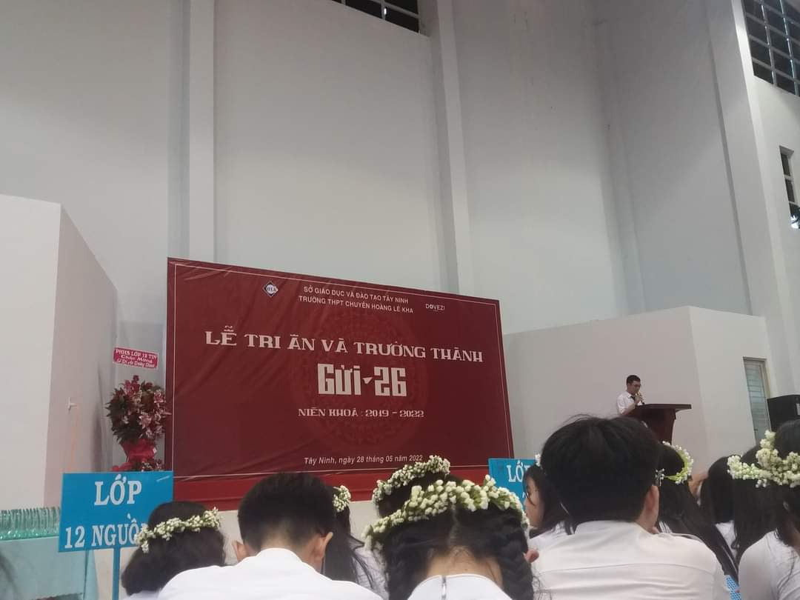

## Kỳ 4: CƠN MƯA THÁNG NĂM... 🌧

**_Này bạn của tôi ơi..._**

**_Vậy là, tháng năm... đã đến rồi nhỉ?_**

_Chuỗi ngày nắng nóng gay gắt như đổ lửa đã chính thức khép lại bằng một cơn mưa hạ trút xối xả._

_Năm nay, mùa mưa diễn ra muộn hơn so với các năm về trước, nhưng có còn hơn không. Chúng ta đều rất mong chờ cơn mưa này, không đơn giản nhằm để giải tỏa cơn nóng nực bức bối, mà còn nhằm để gột rửa sạch sẽ tâm hồn dính nhiều vết bụi bẩn sau một thời gian bon chen ở phố thị xa hoa._

_Cơn mưa tháng năm xuất hiện rồi đấy, **bạn của tôi ạ!** Điều này cũng đồng nghĩa rằng một lứa học sinh nữa **sắp ra trường rồi đấy!** Có lẽ, ông trời cũng không che giấu được nỗi buồn khi quãng thanh xuân của các em học sinh cuối cấp đang dần **đi vào hồi kết**, nhỉ?_

_Dạo gần đây, dẫu tôi đang trong tình trạng "**đầu tắt mặt tối**" chuẩn bị cho các bài kiểm tra cuối kì, nhưng tôi vẫn online khắp các trang mạng xã hội và âm thầm dõi theo cuộc sống của những thần dân ở Hoàng chuyên, đặc biệt là các em khóa 28. Quỹ thời gian ở Hoàng chuyên của các em giờ đây vô cùng ít ỏi, đếm ngược đến cột mốc cuối cùng chỉ còn **tính bằng ngày**. Tôi nghĩ giai đoạn này, các em đang cố tạo ra thật nhiều kỉ niệm về Hoàng chuyên như một cách để khắc cốt ghi tâm về **thời hoa niên rực rỡ**..._

**_Lòng tôi lại đổ mưa vì nỗi nhớ vẫn chưa bao giờ vơi..._**

_Hai câu thơ tôi làm từ năm ngoái, đến tận bây giờ vẫn hữu dụng:_

> **_Hôm nay lòng lại đổ mưa_**
>
> **_Một niềm thương nhớ lại đưa tôi về..._**

_Cách đây hai năm trước, khóa 26 của tôi vẫn đang rục rịch chuẩn bị cho mùa tri ân trưởng thành. Cơn mưa khi ấy đến sớm và đến dai dẳng cho đến tận cuối buổi lễ. **Ông trời khóc òa nhiều lắm!** Có lẽ vì khóa chúng tôi là khóa duy nhất trải qua ba năm cấp Ba **không trọn vẹn**... Ba năm đồng hành cùng nhau, nhưng một nửa thời gian chúng tôi chỉ có thể kết nối với nhau thông qua những chiếc màn hình trực tuyến của điện thoại và máy tính. Thật may mắn vì cuối cùng khóa chúng tôi đã có buổi lễ tri ân và trưởng thành đong đầy nụ cười và nước mắt cùng gia đình, bạn bè, thầy cô. Tưởng tượng, nếu COVID-19 phá hoại cả sự kiện cuối cùng của thời học sinh, hẳn tôi sẽ rầu rĩ và rũ rượi lắm. Tôi chắc sẽ trông như một bông hoa héo hắt trong phòng kín đã bất thành trong công cuộc đi tìm lấy những giọt nước tinh túy nhằm **níu giữ sự sống**..._

_Tôi đã vô cùng trân trọng và khắc ghi những thước phim "**đắt trời cho**" về buổi lễ. Tuy nhiên, tôi lại cảm nhận được tiến độ của buổi lễ trôi nhanh một cách lạ thường, âm hưởng của buổi lễ cũng chưa thật sự chạm sâu vào tâm khảm. Thật tình, tôi chẳng thể lí giải vì sao lại như vậy... phải chăng là do tôi đã **quá kì vọng về một điều gì đó?**_

**_Cơn mưa đêm ấy trút xối xả ở ngoài sân trường, và cả trong trái tim non nớt của một cô bé sắp tròn mười tám cái xuân xanh. Nước mưa và nước mắt liên tục gột rửa tôi..._** 🌧

_Quay trở về thực tại, với tư cách là một cựu học sinh Hoàng chuyên, tôi hy vọng các em khóa 28 sẽ khép lại quãng thanh xuân của mình bằng "**một cơn mưa rực rỡ**", bù đắp lại cho mở đầu không được trọn vẹn._

**_Chúc các em có một mùa tri ân và trưởng thành thành công và đong đầy cảm xúc!_** ❤️
