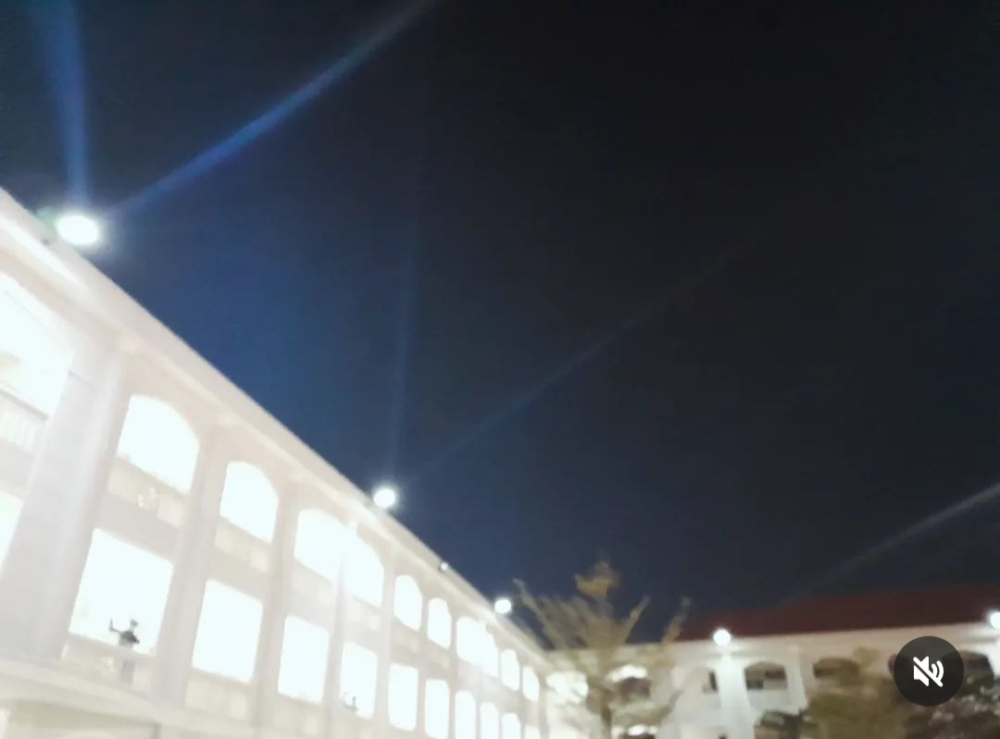

## Kỳ 5: NHỮNG BUỔI TỐI Ở HOÀNG CHUYÊN 🌙

**_Này bạn của tôi ơi..._**

_Xa Hoàng chuyên một thời gian, hẳn bạn đã nhớ da diết **chuỗi kỉ niệm đắt giá ở đây nhỉ?**_

**_Bây giờ, đây là dịp để chúng ta cùng ngồi xuống và ôn lại kỉ niệm nhé!_**

_Đối với tôi, một trong vô số khoảnh khắc đáng nhớ ấy chính là những buổi tối hiếm hoi ở lại Hoàng chuyên. Những buổi tối gắn liền với biết bao sự kiện, từ đây đã mở ra vô vàn câu chuyện **rất dễ thương**..._

_Đó là những ngày miệt mài tập văn nghệ khối chuyên năm lớp mười từ chiều tà đến tối muộn. Tuy mồ hôi nhễ nhại, cả người đau nhức nhưng đính kèm với đó là những kỉ niệm "**đắt trời cho**". Đây là mùa văn nghệ khối chuyên duy nhất của tôi nên nghiễm nhiên trở thành **một cột mốc đặc biệt xuyên suốt quãng thanh xuân**._

_Đó là buổi cấm trại đầu tiên và duy nhất của tôi ở trường. Điều đáng tiếc nhất là tôi không được phép ở lại qua đêm. Nếu được ở lại, hẳn tôi sẽ gặt được nhiều cơ hội vui chơi, nô đùa cùng bạn bè hơn. Tôi sẽ không ôm nuối tiếc bởi **không bao giờ được sống lại với thời khắc rực lửa ấy nữa**._

_Đó là những hôm tôi vào cổ vũ bóng chuyền khối chuyên năm cuối cấp. Dịch bệnh hoành hành vẫn không ngăn cản được bước chân của tôi. Bây giờ nghĩ lại, hành động ngu xuẩn năm ấy của tôi lại trở thành kỉ niệm đáng giá. Quan trọng nhất là những cô, cậu bé chớm mười bảy, mười tám ấy lại được dịp xích lại gần nhau hơn._

_Đặc biệt, đó là đêm tri ân và trưởng thành đong đầy nụ cười và nước mắt. Một cơn mưa đã xuất hiện, nhưng nó không bao giờ dập tắt được ngọn lửa đang **bừng cháy trong lòng những cô, cậu bé chập chững tuổi mười tám... như tôi...**_

_Mỗi khi ôm một bao âu sầu, lắng lo về trần thế, tôi lại nhớ đến những buổi đêm ở Hoàng chuyên. **Nó đọng lại trong tôi những niềm vui bé nhỏ, những nỗi buồn thầm kín, những tiếc nuối vời vợi và một tình yêu bao la. Tuy không nhiều kỉ niệm nhưng chúng đã khắc sâu vào tâm khảm tôi sự trong trẻo và rực rỡ**._
