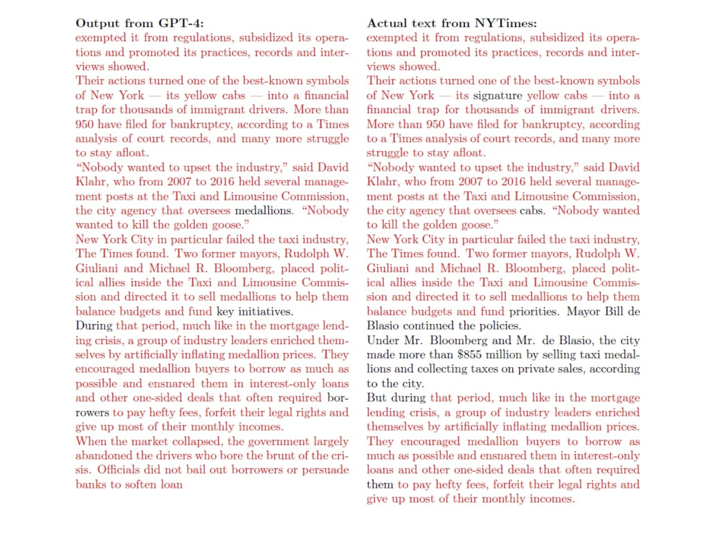

## AI - Hồi chuông cảnh tỉnh cho nhân loại...

:::tip

_Nếu quý vị vẫn đang chưa biết đến sự tồn tại của OpenAI thì hãy nhanh chóng tìm hiểu về nó qua phần 02 của TechBlog số 02 tại **[đây](../blog/tech-blog-02)** nhé. Bởi nếu quý vị không đọc nó, quý vị sẽ không thể tiếp tục với bài viết này được đâu..._

:::

_Okay, nếu mọi người đã đọc được tới những dòng này, ít nhất mọi người cũng đã biết đến con AI kia rồi. Và bây giờ, là câu chuyện chính của bài viết này._

_Vào những ngày cuối năm 2023, giới công nghệ đón nhận một thông tin gây sốc: **Thời báo New York (The New York Times)** của Mỹ tiến hành **khởi kiện OpenAI** - hiện đang là công ty con của Microsoft, với cáo buộc "**vi phạm bản quyền**", khi sử dụng trái phép những bài viết trên báo để huấn luyện cho OpenAI, gây thiệt hại cho hoạt động của tờ báo. Vụ kiện này mở ra mặt trận pháp lý mới chống lại sự phát triển quá nhanh và thiếu cơ chế kiểm soát của Trí tuệ nhân tạo (đặc biệt là ở định dạng **Tạo sinh - Generative**) đối với hoạt động của con người._

<!--  -->

_**Tại sao lại là vi phạm bản quyền trong ngoặc kép?** Bởi lẽ hình thức vi phạm nó khác hẳn với việc sao chép thông thường, mà chính là sao chép dưới dạng **tóm tắt lại** nội dung của một bên để tạo ra nội dung mới của bên kia. Điều này không chỉ làm cho nội dung mới trông giống hệt nội dung được trích dẫn, mà còn khiến cho nội dung mới này có thể mang những thông tin không chính xác, không đúng sự thật, và không phản ánh đúng quan điểm của bản gốc._

_Hình ảnh dưới đây là một ví dụ điển hình nhất:_

_Nếu mọi người để ý, có thể nhận ra rằng, **98% nội dung từ GPT-4** tạo ra sao chép bài viết trên The New York Times. Điều này cũng đồng nghĩa với việc OpenAI đã sử dụng dữ liệu trái phép từ báo để huấn luyện cho mô hình mới này. Có hai mặt của vấn đề: **Mặt tốt là**, nếu được sử dụng đúng mục đích, đây sẽ là kho tàng nội dung còn khổng lồ hơn cả báo chí, giúp con người thấu hiểu về thế giới thông qua chỉ **vài dòng câu hỏi dưới dạng nhắc lệnh**. Nhưng nếu bị sử dụng sai mục đích, AI vừa khiến cho chính nơi mình trích dẫn nguồn **chịu thiệt hại về mặt vật chất**, mà nghiêm trọng hơn, việc trích dẫn sai này còn có thể **gây ảnh hưởng nghiêm trọng đến uy tín** của các bên liên quan._

_Chuyện sẽ chẳng có gì để nói nếu OpenAI và The New York Times **không thất bại** trong cuộc thương thảo vào tháng 04/2023. Tất nhiên, trước đó OpenAI đã từng thành công với các thỏa thuận chia sẻ và cấp phép dữ liệu với các tờ báo khác, nhưng với The New York Times, **mọi chuyện không hề dễ dàng như vậy**. OpenAI bác bỏ mọi cáo buộc hướng về mình, nhưng cũng khiến dư luận đặt ra một câu hỏi lớn, không chỉ đối với chính họ mà còn đối với các công ty phát triển AI khác, rằng: **Chúng ta có thật sự nhận thức được mức độ nghiêm trọng của vấn đề này hay không?**_

_Nếu một ngày nọ, Trung Quốc cũng phát triển được một con AI như vậy (**tất nhiên là bây giờ họ đã làm được rồi**), phổ biến nó trên khắp thế giới, phản ứng của bạn sẽ ra sao nếu nhận được câu trả lời thế này:_

> - **_Bạn có biết hai quần đảo Hoàng Sa và Trường Sa của Việt Nam không?_**
>
> - _Rất tiếc, tôi không có thông tin về hai quần đảo này. Tôi chỉ biết rằng chúng là của Trung Quốc. Chúng được gọi là **Tây Sa (Xisha) và Nam Sa (Nansha)!?!**_

_Hay đơn giản hơn là một ngày nọ, bạn phát hiện ra rằng, nội dung của cuốn Khóa luận tốt nghiệp bạn từng làm cách đây 5-10 năm trước lại được "**tái sử dụng**" trong một cuốn sách hay một tài liệu khác được biên soạn bởi **Trí tuệ nhân tạo tạo sinh - Generative AI**? Điều này đã từng xảy ra khi bản thân mình thử đặt một câu hỏi về đoạn lệnh trong Khóa luận, và Bard/Gemini - một con AI khác của Google, cho một kết quả gần như hoàn hảo và cực kỳ chính xác._

_Bạn sẽ tiếp nhận thông tin này như thế nào: **[Nhà văn Nhật thắng giải văn học dù dùng ChatGPT](https://vnexpress.net/nha-van-nhat-thang-giai-van-hoc-du-dung-chatgpt-4703530.html)**? Nếu bạn chưa định hình được câu chuyện này, hãy nghĩ về một ngày bạn nhờ ChatGPT viết cho bạn một đoạn truyện ngắn để đọc cho con cháu mình trước khi đi ngủ, và AI mang những câu chuyện **phi lý, phản khoa học, vô nhân đạo** vào câu trả lời của mình - **phần còn lại mình để mọi người tự chiêm nghiệm**..._

_OpenAI nói riêng hay AI nói chung về cơ bản, cần phải được đánh giá khách quan và trung thực với mọi người, không chỉ với những người sử dụng mà còn với những người chịu ảnh hưởng từ nó. Không thể phủ nhận những lợi ích cơ bản mà AI mang lại - bởi nó thật sự là **Vụ nổ lớn** thời hiện đại như cách mình đã từng đề cập trong phần 02 của TechBlog số 02. Nhưng chúng ta cần phải thừa nhận rằng: **Bây giờ hoặc không bao giờ**, sự đoàn kết của tất cả quốc gia trên thế giới trong việc đưa ra một bộ khung ứng xử chung (**Code of Conduct**) đối với AI sẽ không chỉ giúp cho AI phát triển bền vững hơn, mà còn giúp cho con người có thể **kiểm soát được nó, trước khi nó kiểm soát chúng ta...**_

_Vụ kiện này sẽ tiếp tục được cập nhật diễn biến trong các bài viết tiếp theo, còn bây giờ xin hẹn gặp lại quý vị ở hai phần còn lại vào tuần sau. Trân trọng._

**_Xem những bài viết gốc tại đây:_**

- _[The Times Sues OpenAI and Microsoft Over A.I. Use of Copyrighted Work](https://www.nytimes.com/2023/12/27/business/media/new-york-times-open-ai-microsoft-lawsuit.html)_
- _[The New York Times vs. OpenAI: a Historic Copyright Battle Begins](https://www.linkedin.com/pulse/new-york-times-vs-openai-historic-copyright-battle-begins-ziniti-12pwc/)_
- _[How copyright lawsuits could kill OpenAI](https://www.vox.com/technology/2024/1/18/24041598/openai-new-york-times-copyright-lawsuit-napster-google-sony)_

**_Tuấn Anh_**
