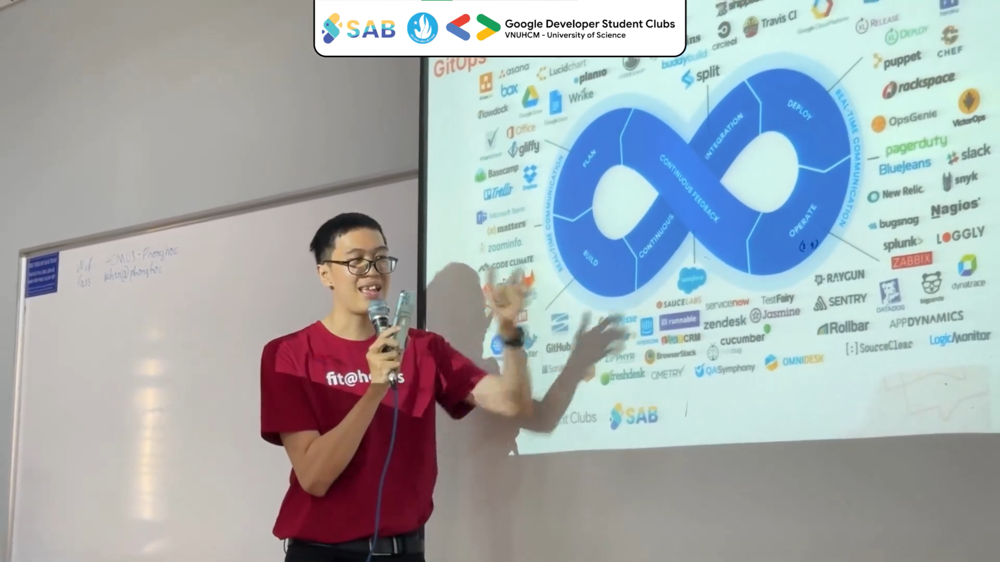

## Cùng đi tìm "Học kỳ bị mất tích"... 📚

_Cuối cùng thì mình cũng có thời gian để viết những dòng này, những dòng tâm tình thật đặc biệt như một món quà đặc biệt gửi tặng bộ phận **Tổ chức sản xuất (BTC)** chương trình, **quý vị khán giả** cùng với lời cảm ơn chân thành nhất gửi đến tất cả mọi người. Bài này viết ngắn thôi, không thể dài dòng được, vì **nói dài thành nói dở**_ 🤣

:::tip

_À mà lần sau BTC đừng bắt anh **content recovery** nha, quá đau khổ rồi, bị mọi người "**hành**" xong bị người ta mắng vốn vì làm ảnh hưởng onsite meeting nữa đó, anh già rồi mấy đứa ơi_ 😂

:::

_Mình biết đến CS101 từ hồi năm cuối Đại học, và mình từng ước mơ được một lần làm một điều gì đó thật sự ý nghĩa, một lần được thử sức với những thách thức mới mẻ. Và rồi, mình đã bắt đầu hành trình của mình tại đây, một hành trình mà mình không bao giờ nghĩ rằng mình sẽ trải qua. Đó là trở thành một **Speaker - Diễn giả** của chương trình..._

_Mình quen một người hậu bối là Thành viên Bộ phận Tổ chức sản xuất chương trình, và mình đã "**lobby**" xin tham gia vào chương trình từ đó (nghe hơi lạ nhưng thực ra chính mình từng hú với tụi nhỏ về ý định đưa những nội dung thực tế vào sự kiện). Thế là phiên 2 mình nhận được mail mời tham dự. Ở phiên 2 vào ngày 03/03/2024, mình mang đến câu chuyện về **DevOps, CI/CD và quy trình phát triển phần mềm** - những thứ thật thân quen với mình nhưng khá xa lạ với rất nhiều người khác - gửi đến tất cả khán giả theo dõi._

_Nhìn lại hình ảnh của bản thân mình trên sân khấu và nhìn về phía khán giả, **mình lại nhớ về những ngày xưa cũ**, khi vẫn còn đang ngồi trên ghế nhà trường, mơ ước về một ngày nào đó mình sẽ trở thành một người có thể chia sẻ những kinh nghiệm mà mình tích lũy được đến tất cả mọi người. **Mình đã làm được điều đó, theo một cách không ngờ tới...**_

> _**Nguồn: GDSC-HCMUS/SAB in HCMUS**. Hình hơi xấu, thông cảm nha mọi người..._ 😂

_Một hành trình nữa đã kết thúc - hành trình đi tìm lại cảm hứng làm việc trong "**Học kỳ bị mất tích**" của mình sau một năm vật lộn trong ngành Công nghệ thông tin đầy biến động và khó khăn. Dọc theo hành trình này, mình nhận được rất nhiều sự ủng hộ và động viên của rất nhiều bạn bè, tiền bối, hậu bối gần xa - kể cả trước, trong và sau sự kiện này._

_Mình luôn có một niềm tin rằng, dù bạn là ai, dù bạn ở đâu, dù bạn làm gì, miễn là bạn cảm thấy **vui vẻ và thoải mái** với công việc và sự nghiệp mà mình đã chọn, thì bạn đã chọn cho mình một **tương lai tốt đẹp hơn** rồi. Hãy cố gắng hết khả năng của mình, và bạn sẽ không bao giờ cảm thấy hối tiếc với đời này..._

_Gửi mọi người hai trang mạng xã hội Facebook chính thức của hai đơn vị tổ chức để có thể cập nhật thông tin về các sự kiện và hoạt động khác được tổ chức xuyên suốt trong năm (**Đây là chỗ PR trá hình, tiền của mỗi nơi là 50 ngàn đồng Việt Nam, khỏi cảm ơn**)_ 🤣 _:_

- [Google Student Developer Club - HCMUS](https://www.facebook.com/gdsc.hcmus)
- [Student Activities Board in HCMUS](https://www.facebook.com/sab.ctda)

_Hành trình DevOps, Cloud và CI/CD vẫn sẽ còn nối dài với bài viết thứ ba ngay sau đây một tuần nữa với câu chuyện thân quen cùng hai anh bạn, một cũ một mới. Để biết họ là ai thì hẹn gặp lại các bạn ở bài viết tiếp theo. **Trân trọng cảm ơn và kính chào!**_ 🚀

**_Tuấn Anh_**
