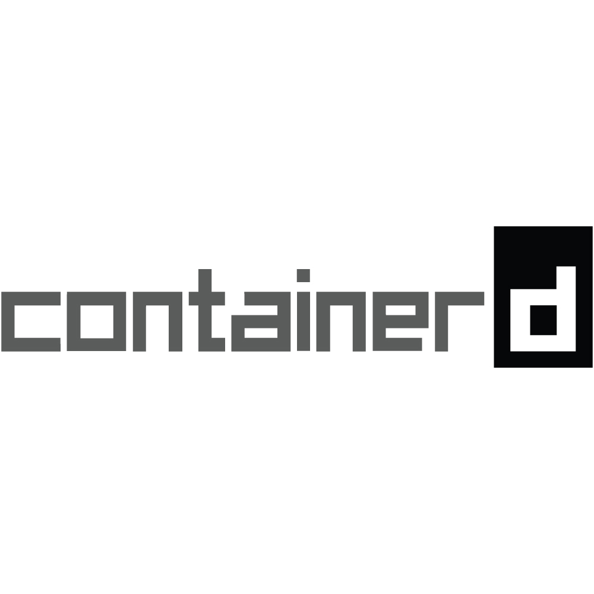

## Welcome Onboard! - Containerd, Docker, Podman

_Xin chào. Đã đến lúc chúng ta vận động một chút rồi. Hãy cùng theo chân mình, bước vào một chuyến hành trình đặc biệt, ở đó, bạn sẽ được gặp gỡ rất nhiều những người bạn đặc biệt, mà có khi bạn chưa từng gặp qua. **Are you ready? Welcome Onboard!**_

### Người bạn đầu tiên: [Con thuyền Docker](https://www.docker.com/)

_Chà, **chắc hẳn bạn đã từng nghe qua về Docker rồi đúng không?** Docker là một công cụ giúp bạn có thể đóng gói ứng dụng của mình vào các container, và chạy chúng trên môi trường máy chủ một cách dễ dàng. Điều này giúp cho việc triển khai và quản lý ứng dụng trở nên nhanh chóng và hiệu quả hơn._

_Điểm đặc biệt của con thuyền này chính là khả năng chở rất nhiều container khác nhau, cùng với hệ thống mạng lưới kết nối được triển khai trên thuyền (**tuy có phần giới hạn hơn so với môi trường máy chủ thực sự**). Đây là một nơi thích hợp cho các hoạt động chuyên chở hàng hóa nặng, hoặc là nơi lưu trú tạm thời cho những người muốn khám phá thế giới thông qua mã nguồn chương trình._

_Nếu để tìm một điểm để chê bai chiếc thuyền thì chắc sẽ là **sự cồng kềnh** của nó. Thật sự để làm chủ nó không phải là điều đơn giản, nhưng thật may là **bạn không cô đơn** - có rất nhiều người từng đi trên con thuyền này sẽ giúp bạn vượt qua những khó khăn đó._

### Người bạn thứ hai: [Containerd - Thuyền trưởng mới](https://containerd.io/)

_"**Hello world**" - **Containerd** chào mọi người. Đây là một thuyền trưởng mới, một gương mặt mới trong thế giới container. Được phát triển từ Docker, Containerd giúp bạn quản lý các container một cách hiệu quả hơn, đồng thời giúp bạn tận dụng tối đa khả năng của con thuyền Docker. Điểm giống nhau và cũng là khác nhau giữa hai vị thuyền trưởng cũ và mới là yếu tố daemon._

_Containerd có thể chạy như một **daemon riêng biệt**, hoặc là một phần của Docker. Containerd cũng giúp bạn giảm bớt sự cồng kềnh của Docker, giúp bạn tập trung vào việc chính của mình hơn. Nhưng có 1 điểm containerd không làm được: **Khả năng kết nối hệ thống** với nhau, vì bản thân Containerd không tự động nhớ đến việc mang lên thuyền bộ công cụ này. Điều này đòi hỏi rất nhiều công sức, thời gian cho việc nghiên cứu cách dùng nó. Mặc cho sự gọn nhẹ, Containerd vẫn không thể thay thế hoàn toàn Docker trong một số hoàn cảnh nhất định..._

### Người bạn thứ ba: [Podman - Những chú hải cẩu tinh nghịch](https://podman.io/)

_À, người bạn mới đây rồi... **Podman** - một công cụ quản lý container mà không cần daemon. Người ta bảo, một nhóm hải cẩu hợp lại với nhau sẽ thành một pod (và **trông chúng thật dễ thương**_ 😂 _). Podman giúp bạn có một nơi quản lý container, vừa đơn giản, vừa gọn nhẹ, lại còn dễ sử dụng và an toàn cho mình. Tất nhiên, vì đây là những người bạn khá lạ lẫm - **tụi nó là hải cẩu chứ có phải con người hay đồ vật đâu** - nên vẫn còn đó nhiều thiếu sót. Nhưng hãy nhìn cái cách đàn hải cẩu **thích nghi với môi trường sống chả cần daemon**, bạn sẽ thấy nó thật sự quá thông minh cho một vé lên tàu tận hưởng thế giới này rồi._

_Thật sự, ngay cả bản thân mình cũng chưa từng quen biết đàn hải cẩu này, nhưng vì tụi nó quá dễ thương và quá là đỉnh cao, nên mình đã quyết định mời tụi nó lên tàu cùng mình. Điều này giúp mình có thêm nhiều trải nghiệm mới, cũng như hiểu rõ hơn về thế giới container. **Còn bạn, bạn sẽ chọn ai?**_

### Còn nhiều bạn hơn thế nữa...

_Tất nhiên, vẫn còn quá sớm để xem thử có ai còn chưa lên thuyền không. Nhưng việc cho ba người bạn này lên tàu đã là **một bước ngoặt rồi** - đây là những người bạn đầu tiên, những người bạn mà mình tin tưởng, và mình chắc chắn rằng, chúng sẽ giúp mình cũng như các bạn có thêm động lực để tìm hiểu hơn về thế giới muôn sắc màu này. Con thuyền đã cập bến đầu tiên, tụi mình xuống thuyền đây. **Hẹn gặp lại các bạn ở bến tiếp theo nhé!**_
