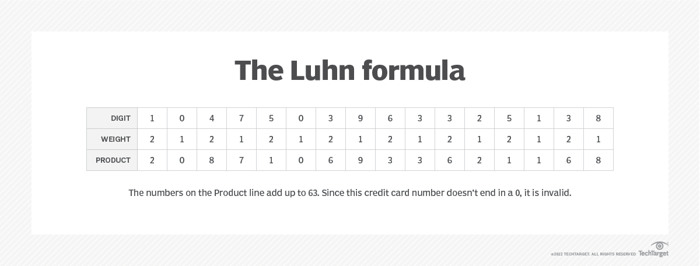

## Chuyện ở Microsoft Support

_Như vậy là chỉ sau hơn bốn tháng rưỡi công tác, tôi cũng đã kết thúc nhiệm vụ của mình với vai trò **Kỹ sư hỗ trợ tại iTechWX** - một đơn vị hợp tác với **Microsoft**. Trụ sở chính của đơn vị được đặt tại Trung Quốc, và chính vì thế nguồn lực tài chính của đơn vị này là không thiếu. Thứ duy nhất còn thiếu ở đây là **thiếu thời gian** (vâng, tôi không nói đùa đâu)_ 🤣


### Một ngày điển hình của Anthony

_Mỗi ngày, nhiệm vụ của tôi là tiếp nhận và hỗ trợ cho ít nhất **hai khách hàng mới**. Đồng thời, các vấn đề của những khách hàng cũ chưa giải quyết được vẫn phải tiếp tục theo dõi và liên lạc khi cần. Có những ngày, số lượng khách cần hỗ trợ trên hàng đợi của tôi lên đến con số **20** - một con số khiến tôi choáng ngợp. Điều đáng lưu tâm ở đây là yêu cầu theo sát "**hàng ngày**", ngoài ra mỗi yêu cầu có phương thức liên lạc khác nhau, đòi hỏi việc mình luôn duy trì trực điện thoại và email suốt từ **8h sáng đến 5h chiều**._

**_Chuyện tăng ca, gần như là cơm bữa..._**

### Tấn công và Phòng thủ


> **Nguồn**: [C# Corner](https://www.c-sharpcorner.com/article/alert-policies-in-the-office-365-security-compliance-center/)

_Nhóm tôi tham gia là nhóm **SCC (Security and Compliance Centers)**, một trong những nhóm trực tiếp làm việc với những vấn đề liên quan đến tất cả phương thức tấn công và phòng thủ trên các hệ thống của Microsoft. Tại đây, mình được học rất nhiều thứ về công nghệ, đặc biệt là các **hình thức tấn công** phổ biến diễn ra trên không gian mạng cũng như một số giải pháp **bảo vệ dữ liệu mật chống thất thoát** ra bên ngoài. Để nói về lí do mà mình phải lựa chọn ngưng việc, có hai điều mình đã lưu tâm:_

1. **_Do áp lực lớn về số lượng và yêu cầu theo dõi khách mỗi ngày_**
2. **_Do một số vấn đề cá nhân_**

_Tất nhiên, sẽ là vô nghĩa nếu như cứ vịn vào câu "**Muốn thì tìm cách, không muốn sẽ tìm lý do**" để bào chữa cho năng lực của bản thân mình. Nhưng sẽ có ý nghĩa hơn khi vào ngày cuối cùng mình làm việc tại công ty, mọi người gửi cho mình những món quà cảm ơn vì "**không để lại bất kỳ gánh nặng lớn nào**" liên quan đến vé hỗ trợ của khách hàng (tự nhiên thấy nhẹ nhõm vì không bị mọi người gọi là "**báo thủ đời đầu**")_ 🤣 

### Những câu chuyện vui và bài học cho tất cả chúng ta


_Trong quá trình thực hiện nhiệm vụ của mình, tôi bắt gặp một vấn đề khá hóc búa: **Làm sao để bảo vệ dữ liệu thẻ tín dụng của các ngân hàng khi chia sẻ qua các nền tảng khác?**. Từ đây, hành trình khám phá ra bí mật đằng sau các dãy số trên những chiếc thẻ **VISA, MasterCard** được bắt đầu:_

1. _Ngay sau khi nhận được yêu cầu, tôi nhanh chóng bắt tay vào thực hiện phân tích và hỗ trợ, tuy nhiên khách hàng có vẻ khá khó tính, **không đồng ý với bất kỳ giải pháp "chữa cháy" nào**._
2. _Tôi tiếp tục phân tích thông tin của dãy số, và dần dần phát hiện ra vấn đề lớn: Dãy số thẻ tín dụng đều có quy luật chung của nó cả. Và mỗi dãy số thẻ đều tuân thủ nghiêm ngặt theo **thuật toán Luhn** - **thuật toán "đồng dư modulo 10"**. Lúc này khách hàng có vẻ như đã hiểu ra được vấn đề thật sự nằm ở sự "**ngẫu nhiên**" đầy tai hại này._
3. _Khách hàng yêu cầu giải pháp tiếp theo nhằm đảm bảo **không thất thoát số thẻ tín dụng nhưng vẫn cho phép chia sẻ các mã số khác**. Lúc này yêu cầu trở nên khó khăn, và ở thời điểm đó, theo như yêu cầu từ phía Microsoft, tôi tiến hành tham vấn với chuyên viên cấp cao của nhóm và **xin hỗ trợ trên vé của khách**._

_Tới đây, tôi chợt hiểu ra một điều: **Hóa ra tất cả chúng ta đều bị lừa** - mọi chiếc thẻ tín dụng quốc tế, đều có chung 1 bộ khung, đồng nghĩa với việc nếu để lộ ra dù **chỉ có một chút thông tin trên thẻ**, cũng sẽ gây ra rất nhiều hệ lụy cho chính bản thân chủ thẻ. Vấn đề bảo mật dữ liệu nhạy cảm, cũng vì thế, **ngày càng trở nên cấp thiết**, nhất là trong hoàn cảnh công cuộc chuyển đổi số đang diễn ra ngày càng mạnh mẽ hơn bao giờ hết._

_Tại thời điểm tôi kết thúc công tác, việc hỗ trợ vẫn đang tiếp tục diễn ra. Cũng đang hóng xem là chuyên viên đã xử lý tới đâu rồi, và khách đã giải quyết được vấn đề hay chưa, chứ để mang tiếng đẩy việc khó cho chuyên viên thì **khổ thân tôi lắm**_ 😂

### Phụ lục: Thuật toán Luhn

_Thuật toán này được một kỹ sư của IBM tên là **Hans Peter Luhn** tạo ra nhằm mục đích tạo sinh mã định danh cho nhiều loại giấy tờ khác nhau. Thuật toán này đựợc cấp bằng sáng chế số 2.950.048 tại Mỹ vào ngày **23/08/1960**, và được đưa vào chuẩn **ISO/IEC 7812-1** dùng rộng rãi trong thời điểm hiện nay._

_Thuật toán này được sử dụng ở các loại giấy tờ như: **Thẻ tín dụng**, mã IMEI (định danh điện thoại), **số Bảo hiểm xã hội** Canada (Gia Nã Đại) và Hy Lạp, **số căn cước công dân** của Nam Phi, Israel (Do Thái), Thụy Điển, ..._



> **Nguồn**: [TechTarget](https://www.techtarget.com/searchsecurity/definition/LUHN-formula)

_Dưới đây là mã giả của thuật toán này cũng như một số mã nguồn mẫu bằng các ngôn ngữ khác nhau, thu thập từ **[Wikipedia](https://en.wikipedia.org/wiki/Luhn_algorithm)**. Mọi người cũng có thể đọc bài viết này để hiểu thêm cách thuật toán hoạt động._

```bash title="Pseudocode.txt"
# Pseudo code for the algorithm

function isValid(cardNumber[1..length])
    sum := 0
    parity := length mod 2
    for i from 1 to length do
        if i mod 2 != parity then
            sum := sum + cardNumber[i]
        elseif cardNumber[i] > 4 then
            sum := sum + 2 * cardNumber[i] - 9
        else
            sum := sum + 2 * cardNumber[i]
        end if
    end for
    return cardNumber[length] == (10 - (sum mod 10))
end function
```

```csharp title="luhn.cs"
// Csharp version

bool IsValidLuhn(in int[] digits)
{
    int check_digit = 0;
    for (int i = digits.Length - 2; i >= 0; --i)
        check_digit += ((i & 1) is 0) switch
        {
            true  => digits[i] > 4 ? digits[i] * 2 - 9 : digits[i] * 2,
            false => digits[i]
        };

    return (10 - (check_digit % 10)) % 10 == digits.Last();
}
```

```java title="luhn.java"
// Java version

public static boolean isValidLuhn(String number) {
    int n = number.length();
    int total = 0;
    boolean even = true;
    // iterate from right to left, double every 'even' value
    for (int i = n - 2; i >= 0; i--) {
        int digit = number.charAt(i) - '0';
        if (digit < 0 || digit > 9) {
            // value may only contain digits
            return false;
        }
        if (even) {
            digit <<= 1; // double value
        }
        even = !even;
        total += digit > 9 ? digit - 9 : digit;
    }
    int checksum = number.charAt(n - 1) - '0';
    return (total + checksum) % 10 == 0;
}
```

```tsx title="luhn.tsx"
// TypeScript version

function luhnCheck(input: number): boolean {
  const number = input.toString();
  const digits = number.replace(/\D/g, '').split('').map(Number);
  let sum = 0;
  let isSecond = false;
  for (let i = digits.length - 1; i >= 0; i--) {
    let digit = digits[i];
    if (isSecond) {
      digit *= 2;
      if (digit > 9) {
        digit -= 9;
      }
    }
    sum += digit;
    isSecond = !isSecond;
  }
  return sum % 10 === 0;
}
```

```python title="luhn.py"
# Python version

class LuhnAlgorithm:
    """Class to validate a number using Luhn algorithm.
    
    Args:
        input_value (str): The input value to validate.

    returns:
        bool: True if the number is valid, False otherwise.        
    """
    def __init__(self, input_value: str) -> None:
        self.input_value = input_value.replace(' ', '')
    
    def last_digit_and_remaining_numbers(self) -> tuple:
        """ Returns the last digit and the remaining numbers """
        return int(self.input_value[-1]), self.input_value[:-1]
    
    def __checksum(self) -> int:
        last_digit, remaining_numbers = self.last_digit_and_remaining_numbers()
        nums = [int(num) if idx % 2 != 0 else int(num) * 2 if int(num) * 2 <= 9 \
                else int(num) * 2 % 10 + int(num) * 2 // 10 \
                    for idx, num in enumerate(remaining_numbers)]

        return (sum(nums) + last_digit) % 10 == 0
    
    def verify(self) -> bool:
        """Verify a number using Luhn algorithm."""            
        return self.__checksum()
```

_Và đây là tất cả những gì mà bài viết này mang đến cho tất cả mọi người. Hy vọng mọi người từ đây sẽ hiểu rõ và ý thức hơn trong quá trình bảo vệ dữ liệu cá nhân của mình. Xin hẹn gặp lại quý vị ở phần 2 - nơi mà một câu chuyện mới về **Giám sát hệ thống** sẽ được trình bày. Tạm biệt._

**_Tuấn Anh_**