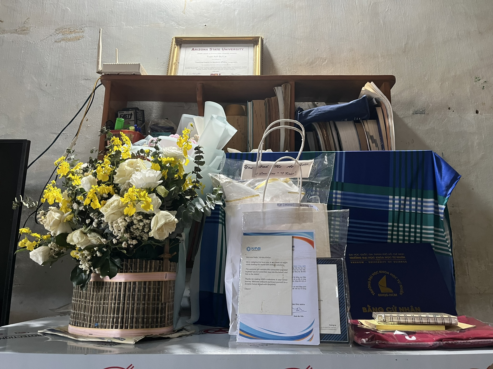
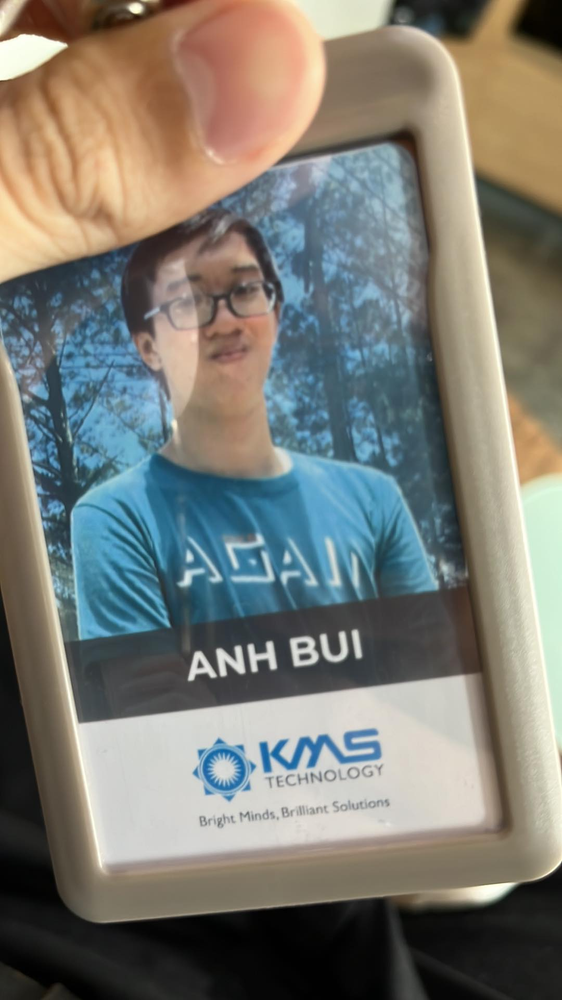
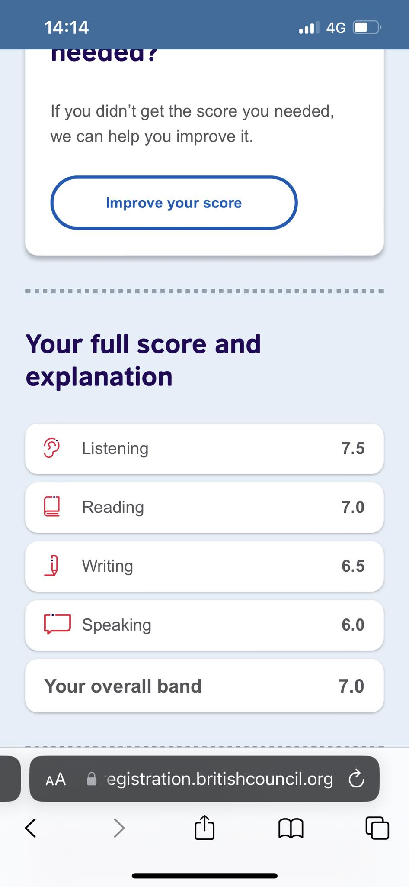
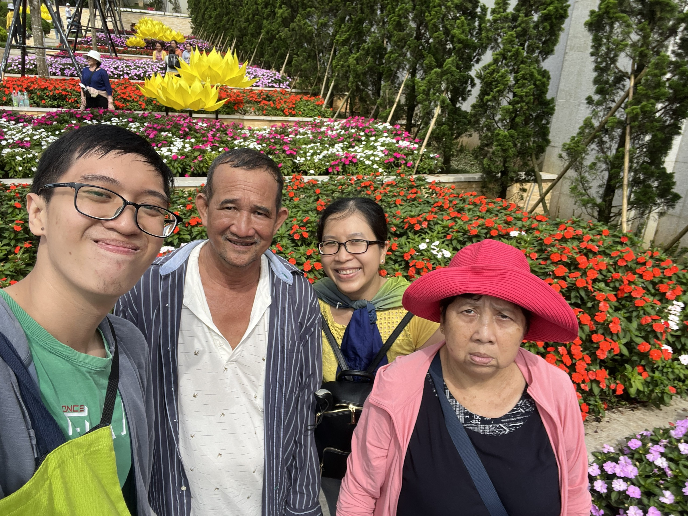

## Kỳ 1: Recap 2023 - Điều nhỏ bé kỳ diệu ⏪

Cuối cùng thì ngày này lại tới, một lần nữa. Hôm nay, ngày 31/12/2023, có nhiều thời gian hơn mọi ngày, tôi quyết định mở lại những tấm hình đẹp nhất và chiêm nghiệm lại một năm 2023 đầy thăng trầm của chính mình.

### 4 năm, trôi qua như làn gió nhẹ của thời thanh xuân...

Chắc hẳn, mọi người còn nhớ đến những giây phút mà ở đó, mình đã đưa chiếc check Tốt nghiệp đúng hạn vào trong wishlist của năm 2023. Ừ thì, **_mình đã làm được rồi_**. Chỉ tiếc là kết quả lại không thể như ý muốn của bản thân mình. Ước mơ được một lần chơi với Thách thức cũng đã lỡ hẹn... Dẫu sao đó cũng là một chuyến hành trình bất tận, với đủ những gia vị thú vị để làm nên một "**_thời thanh niên sôi nổi_**" của bản thân mình:

- **Nhận một chiếc học bổng đầy ý nghĩa từ Khoa, và được trao tặng trực tiếp trong Lễ tuyên dương của Khoa** 💯.
- **Tham gia vào loạt sự kiện cấp Đoàn - Hội, với rất nhiều những người bạn, những người đồng đội tuyệt vời** ❤.
- **4️⃣/8️⃣ kỳ liên tục có điểm rèn luyện loại Xuất sắc và 3️⃣/8️⃣ kỳ đạt loại Giỏi, 2️⃣/8️⃣ kỳ liên tục có điểm học tập loại Xuất sắc. Khổ luyện bấy nhiêu năm, cũng có chút thành quả để khoe với mọi người** 😂.

### Câu chuyện từ những chuyến đi...

Năm qua là một năm với quá nhiều những biến động. Từ câu chuyện mất đi người bà yêu quý của mình (**_dẫn đến việc không có chỗ dựa từ ông bà_**), cho đến những chấn thương, những căn bệnh hành hạ bản thân mình từ ngày này qua tháng nọ, việc được sống và được đi thực tập, thử việc tới **_hai nơi trong cùng một năm_** này đã là một kì tích. Dẫu rằng mọi việc có thể không hoàn hảo và đi đến đích cuối cùng, nhưng ít nhất nó vẫn mang lại nhiều những trải nghiệm thú vị trên con đường mà mình đã chọn.

### IELTS và câu chuyện về một chiếc check kéo dài...

Cuối cùng thì kỳ thi IELTS cũng được tổ chức lại trực tiếp, và tất nhiên mình cũng mất **_gần một năm_** để chuẩn bị cho lần thi lại này. Thực ra sẽ là lời nói dối nếu tiết lộ rằng, **_số điểm của lần này làm hài lòng bản thân mình_**, nhưng ít ra, trên từng những kỹ năng mà mình tích lũy, cuối cùng nó cũng có những sự **_cải thiện rõ nét_** mà mình mong đợi. Tất nhiên, chặng đường IELTS vẫn sẽ tiếp tục trong hai năm tới, còn bây giờ vẫn là **_ôn luyện cho vững tâm_** đã 🤣.

### Những chuyến du lịch đầy ý nghĩa...

Thực ra, đất nước Việt Nam 🇻🇳 mình có rất nhiều những điểm đến thật đẹp, cũng như những nơi mà mình chưa từng khám phá. Ngay cả mình - một người con Tây Ninh chính hiệu, cũng chưa từng lên đỉnh **_núi Bà Đen_** cao nhất Đông Nam Bộ lần nào, **_cho đến ngày lễ Quốc khánh_**...

Cả gia đình cùng nhau đi cáp treo lên đỉnh núi chơi, chắc cũng lâu lắm rồi mới có dịp được đi chơi cùng nhau như thế này. Và thật sự khi đến nơi, tất cả đều **choáng ngợp** trước vẻ đẹp của nơi mình sinh ra và lớn lên, nó quá đẹp mà rất khó để có thể dùng bất kỳ mĩ từ nào để miêu tả về nó. Năm nay sẽ lại là một năm mà du lịch tỉnh nhà sẽ lại được ưu tiên, và **_Tây Ninh - Hành trình rạng rỡ_** là chương trình khởi đầu cho sự phát triển đó...

## Wishlist

Để mà nói về năm 2024, chắc wishlist sẽ như thế này:

✅ Tìm kiếm một công việc theo dạng Hybrid hoặc Remote toàn thời gian. Nếu không được, chắc chuyển sang Full-time nhưng ở quê nhà cho vui 😂.

✅ Đi du lịch thêm nhiều điểm nữa (đặc biệt là ra nước ngoài). Đã gần 6 năm kể từ chuyến đi nước ngoài đầu tiên, đây chắc hẳn là mong muốn lớn nhất của mình.

✅ Kiếm được nhiều tiền, và có thể triển khai một dự án gì đó. Thực ra thì cũng chưa biết là dự án gì, nhưng ít ra là có liên quan đến Công nghệ thông tin và Tiếng Anh - hai đối trọng mà mình cùng lúc theo đuổi.

✅ Có thể đạt được một số chứng chỉ nào đó, như là AWS, Azure. À thì cái này cũng là mong ước của mình khi theo đuổi Công nghệ thông tin, theo kiểu năm chẵn thi AWS, năm lẻ thi IELTS chẳng hạn để có thể tối ưu được thời gian và lượng kiến thức cần ôn luyện.

## Tổng kết

Hết phần recap. Một lần nữa, chân thành cảm ơn tất cả mọi người đã giúp đỡ để tôi có thể vượt qua năm 2️⃣0️⃣2️⃣3️⃣ đầy chông gai thử thách nhưng cũng nhiều "**_điều nhỏ bé kỳ diệu_**" này. Hy vọng năm 2️⃣0️⃣2️⃣4️⃣, tất cả chúng ta sẽ có nhiều sức khỏe và thành công. Mọi thứ đã trở lại bình thường, và tất cả sẽ không ngừng phát triển hơn nữa.

🏡 2️⃣0️⃣2️⃣3️⃣, một năm đầy cảm xúc đã kết thúc. Chúng ta chia tay nhau từ đây. Chào từ biệt 2️⃣0️⃣2️⃣3️⃣, và xin chào 2️⃣0️⃣2️⃣4️⃣.

🌸 Câu chuyện mùa xuân 2️⃣0️⃣2️⃣3️⃣/2️⃣4️⃣ 🌼 - Kỳ 2️⃣ sẽ lên sóng trong vài ngày nữa. Goodbye mọi người, tôi đi làm lại web tiếp đây 😂
