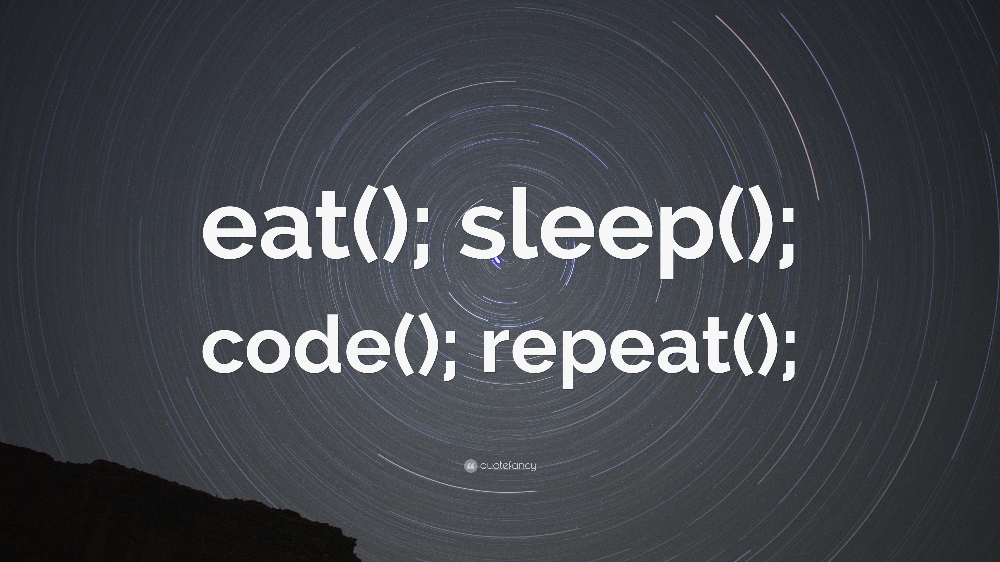
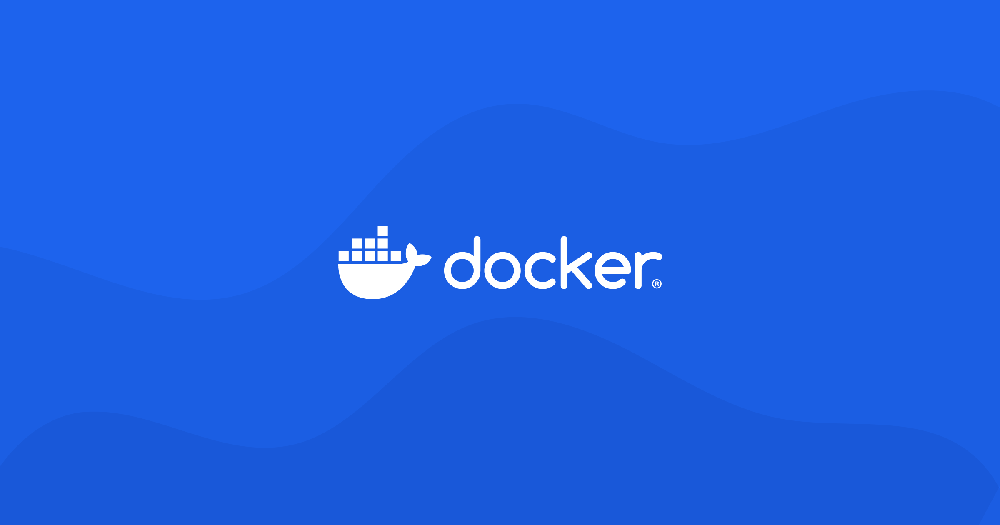
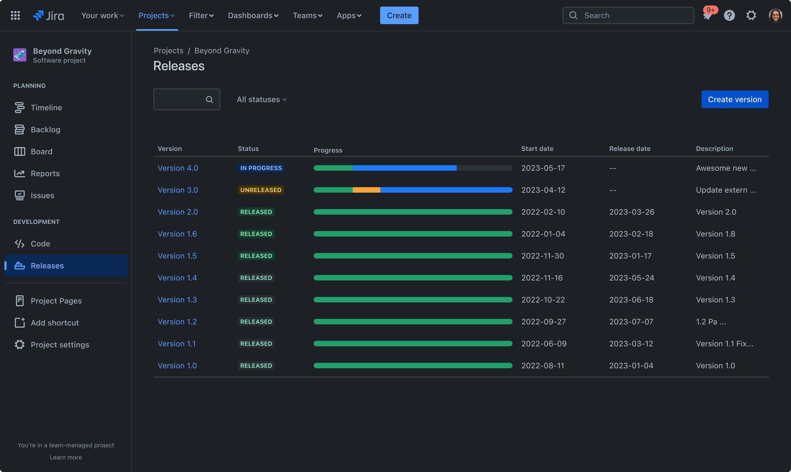
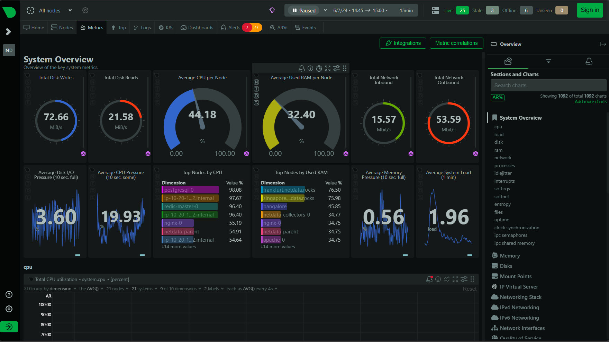

## Ngày 5: Vòng lặp DevOps ♾

_Xin chào mọi người, cuối cùng chúng ta đến chặng 5 - chặng áp chót của Giai đoạn 1 hành trình **90 ngày cùng DevOps** đầy "bất
ổn" nhưng cũng nhiều niềm vui này. Ngay bây giờ chúng ta sẽ đến ngay với chiếc vòng lặp DevOps mà mình đã chia sẻ với mọi người
ở phần đầu của hành trình này._

_Bài này sẽ ít tấu hài hơn, vì đơn giản đây là lúc mà chúng ta cần những thứ chuyên sâu hơn. **Nào, bắt đầu thôi!**_

### Các giai đoạn trong vòng lặp

_Trước đó chúng ta có **Kế hoạch 7 bước** cho việc tích hợp Agile và DevOps với nhau. Thực chất DevOps có tới **8 
giai đoạn chính**._

#### Plan - Lên kế hoạch 📑

_Làm gì cũng vậy, **một bản kế hoạch chỉnh chu luôn là thứ cần thiết nhất cho một dự án triệu đô**. Đây là lúc nhóm phát triển 
họp lại với nhau để thảo luận và tìm ra các tính năng cũng như bản sửa lỗi mà họ muốn có trong chặng tiếp theo._ 

_Đây cũng là lúc mà các kỹ sư DevOps cũng sẽ tham gia tìm hiểu những phần liên quan tới công việc của mình. Bạn cũng có thể 
đóng góp ý kiến vào các quyết định quan trọng của nhóm phát triển, giúp họ có thể **làm việc tốt với cơ sở hạ tầng** mà bạn 
đã xây dựng hoặc hướng đến **một lựa chọn tối ưu hơn** nếu nhóm đang không lựa chọn phương án tốt nhất._ 

_Một điều nên nhớ là nhóm phát triển phần mềm giờ đây đang được xem là khách hàng của nhóm DevOps, vì thế đây chính là cơ hội 
tuyệt vời để cùng nhau tìm ra giải pháp phù hợp với tất cả mọi người trước khi mọi thứ "**chệch khỏi đường ray**" và khiến 
dự án bị "**vỡ tổ ong**"._

> **Nguồn**: [Reddit](https://www.reddit.com/r/ProgrammerHumor/comments/8cum89/starting_a_new_project/)

#### Code - Lập trình 👨‍💻

_Ở giai đoạn này, các kỹ sư DevOps sẽ **không trực tiếp tham gia** (như đã từng đề cập ở [**chặng 4**](../day4)); thay vào đó, 
họ sẽ đưa ra các ý kiến đóng góp để hỗ trợ các lập trình viên có được cái nhìn tổng quan nhất về cơ sở hạ tầng của ứng dụng, 
cũng như các dịch vụ sẽ cung cấp cho người dùng đầu cuối và **cách sử dụng sao cho hợp lý**._

> **Nguồn**: [QuoteFancy](https://quotefancy.com/quote/4050451/eat-sleep-code-repeat-Wallpaper)

#### Build - Xây dựng 🏗

_**Đến lúc DevOps ra tay**, chúng ta sẽ sử dụng mã nguồn đã có sẵn và xây dựng ứng dụng. Tuỳ thuộc vào ngôn ngữ nhóm phát triển
sử dụng mà chúng ta có thể sẽ chuyển mã, biên dịch hoặc thậm chí là xây dựng một **mẫu Docker (image)** từ mã nguồn. Dù như 
thế nào đi nữa, chúng ta vẫn sẽ sử dụng các **CI/CD pipeline (quy trình)** cho giai đoạn này._

> **Nguồn**: [Docker](https://www.docker.com/community/open-source/)

#### Test - Kiểm thử ✅

_Sau khi dựng xong ứng dụng, việc tiếp theo cần làm trước khi phát hành phiên bản mới của ứng dụng là chuyển sang giai đoạn 
kiểm thử. Các **tình huống kiểm thử (test case)** sẽ được nhóm Kiểm định hoặc nhóm Phát triển lập trình trước, tuy nhiên 
chúng ta có thể góp ý sao cho phù hợp._

_Một tình huống thực tế được đưa ra, đó là việc ứng dụng không bao quát được tất cả tình huống lỗi có thể xảy ra trong quá 
trình người dùng cuối sử dụng sản phẩm, thường gọi là **giới hạn biên (Edge)**. Thực ra đây là một trường hợp bình thường, 
bởi lẽ, mục đích chính của việc này nhằm giúp giảm lỗi và đảm bảo hai điều:_

1. _**Không có lỗi mới** phát sinh trong quá trình vận hành phiên bản mới._
2. _Phiên bản mới **không tác động** đến các tính năng đang vận hành bình thường._

> **Nguồn**: [Reddit](https://www.reddit.com/r/ProgrammerHumor/comments/oxq5no/edge_cases_be_like/)

#### Release - Phát hành 📱

**_Đến lúc phát hành ứng dụng rồi._**

_Quá trình này không phụ thuộc vào mã nguồn hay phương thức dựng ứng dụng._

_Mã nguồn có thể được lưu trữ ở bất kỳ đâu, chẳng hạn như **GitHub** hoặc kho lưu trữ git, hoặc mã nguồn đã biên dịch dưới dạng 
tập tin **.exe** hay **Docker image** đã được lưu giữ trong **sổ đăng ký (registry)** hoặc **kho lưu trữ (repository)** và 
có thể truy cập được từ máy chủ sản xuất trong quá trình triển khai._

> **Nguồn**: [Python for Undergraduate Engineers](https://pythonforundergradengineers.com/git-and-github-for-undergrad-engineers.html)

#### Deploy - Triển khai ⚡

_Cuối cùng, chúng ta triển khai ứng dụng lên **môi trường sản xuất (production)**. Chỉ đến lúc này, doanh nghiệp mới có thể 
nhận ra giá trị từ thời gian, công sức và sự tận tuỵ mà Nhóm DevOps và Nhóm phát triển đã đưa vào sản phẩm._

> **Nguồn**: [Jason St-Cyr](https://jasonstcyr.com/2016/12/24/twelfth-day-of-christmas-deployment-memes/)

#### Operate - Vận hành 📬

_Đây là giai đoạn mà DevOps bận bịu nhất đây: **Nhận phản hồi từ khách hàng, đi tìm nguyên nhân, xây dựng hệ thống điều tiết
và cân bằng tải** cho hệ thống theo các khung giờ nhất định trong ngày. Ngoài ra, còn có một việc nữa mà giai đoạn này cần
quan tâm, đó chính là xây **hệ thống cảnh báo (bằng tay hoặc tự động)** các sự kiện liên quan từ môi trường chính đến nhóm 
Vận hành, và các doanh nghiệp thường được khuyến khích sẽ thực hiện tự động hóa để giảm chi phí và tăng hiệu quả._

> **Nguồn**: [Jira](https://www.atlassian.com/software/jira.com)

#### Monitor - Giám sát 📶

_Đây là giai đoạn cuối cùng của một chu trình. Các chỉ số như tỷ lệ **% sử dụng CPU, RAM, ổ đĩa, thời gian phản hồi** và đặc 
biệt là **nhật trình (logs)**, là những thứ vũ khí quan trọng nhất giúp các thành viên của nhóm Phát triển biết được thực sự
điều gì đang diễn ra và **khắc phục sự cố, mở rộng quy mô** hệ thống tự động hoặc khi cần thiết._

> **Nguồn**: [Netdata](https://app.netdata.cloud/spaces/netdata-demo/rooms/all-nodes/overview)

### Vòng lặp tiếp diễn

_Chu trình hoàn thành, chúng ta sẽ **quay lại từ đầu** bắt đầu bằng việc lên kế hoạch và lặp lại toàn bộ vòng lặp này hằng
ngày/tuần/tháng cho những bản phát hành/cập nhật tiếp theo._

> **Nguồn**: [Jason St-Cyr](https://jasonstcyr.com/2016/12/24/twelfth-day-of-christmas-deployment-memes/)

### Tự động hóa - Liên tục 

> **Nguồn**: [LinearB](https://linearb.io/blog/what-is-continuous-merge)

_Với các dự án lớn, đòi hỏi cần phải **tự động hóa** để tối ưu được nguồn lực cho quy trình phát triển phần mềm. Việc sử dụng
các công cụ cho công cuộc tự động hóa này được gọi là "**Tích hợp và Triển khai liên tục**" (CI/CD). Chúng ta sẽ ghé qua điểm
đến này ở những giai đoạn tiếp theo của hành trình 90 ngày này. Dưới đây là giới thiệu sơ lược của các quá trình._

#### Phân phối liên tục

_Phần này bao gồm các giai đoạn từ **1 tới 4** của Vòng lặp._

1. _Lập kế hoạch (Plan)_
2. _**Lập trình (Code)**_
3. _Xây dựng (Build)_
4. _**Kiểm thử (Test)**_

#### Tích hợp liên tục (CI)

_Phần **Tích hợp liên tục (Continuous Integration)** bao gồm **Phân phối liên tục** và **Giai đoạn 5** của Vòng lặp 
là **Phát hành**. Nếu **thất bại** ở giai đoạn 5 thì phải **quay lui về giai đoạn 1**, nếu thành công sẽ chuyển sang 
**Triển khai liên tục (gồm các giai đoạn tiếp theo từ 6 đến 9)**._

4. _Phát hành liên tục (CI)_
5. **_Phát hành (Release)_**
6. _Triển khai liên tục (CD)_

#### Triển khai liên tục (CD)

_Sau khi **thành công** ở giai đoạn 5, ứng với mỗi bản phát hành, chúng ta đi tiếp tới các giai đoạn từ 6 - 9. Chùm giai đoạn
này được gọi là **Triển khai liên tục (Continuous Delivery/Deployment)**. Cụ thể:_

6. **_Triển khai (Deploy)_**
7. _Vận hành (Operate)_
8. _Giám sát (Monitor)_
