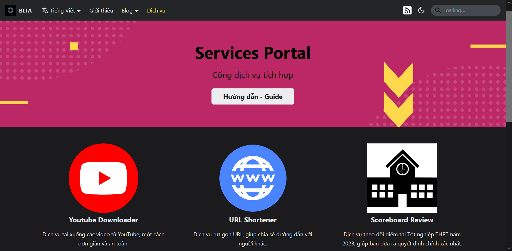

Để sử dụng cổng dịch vụ, có các cách sau:

1. Truy cập vào đường dẫn [**này**](../../services)
2. Từ thanh điều hướng, chọn **Dịch vụ**
3. Từ phần chân trang, mục **Trang chủ** chọn **Cổng dịch vụ**

Màn hình sẽ hiện giao diện như hình dưới.

Chọn dịch vụ muốn sử dụng, nhấn nút **Truy cập**. Hệ thống sẽ tự chuyển hướng đến trang của dịch vụ.

Từ Cổng dịch vụ, người dùng có thể truy cập vào Hướng dẫn này ở nút **Hướng dẫn - Guide**.

Hiện tại hệ thống có ba dịch vụ khác nhau như sau:

1. Dịch vụ **URL Shortener** ([xem hướng dẫn tại đây](./guide/shortener))
2. Dịch vụ **English L&T** ([xem hướng dẫn tại đây](./guide/english))
3. Dịch vụ **Images Gallery** ([xem hướng dẫn tại đây](./guide/gallery))
