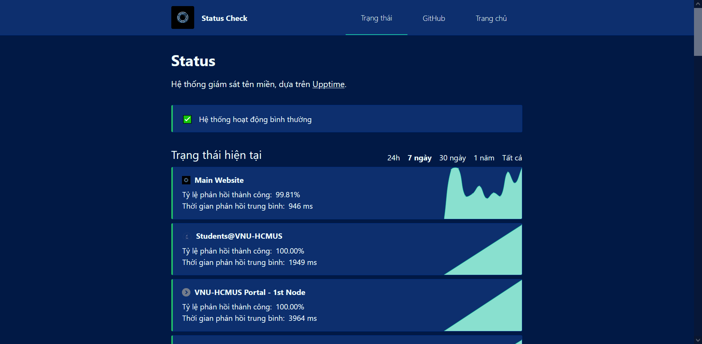

## Giới thiệu

Dịch vụ Status Coverage là một trang web tổng hợp và theo dõi trạng thái của các trang khác nhau. Trang web này được xây dựng dựa trên nền tảng [**Upptime**](https://upptime.js.org).

## Hướng dẫn truy cập

Để sử dụng dịch vụ, có các cách sau:

1. Truy cập vào đường dẫn [**này**](https://status.builetuananh.name.vn/)
2. Từ thanh điều hướng, chọn **Dịch vụ**
3. Từ phần chân trang, mục **Trang chủ** chọn **Cổng dịch vụ**

Chọn dịch vụ **Status Coverage**, nhấn nút **Truy cập**. Hệ thống sẽ tự chuyển hướng đến trang của dịch vụ như hình dưới.

:::note LƯU Ý

Giao diện ứng dụng sử dụng ngôn ngữ **tiếng Việt**.

:::

## Hướng dẫn theo dõi

### Trạng thái hiện tại

Mục này sẽ hiển thị trạng thái hiện tại của các trang web được theo dõi. Mục này cung cấp hai thông tin quan trọng là tỷ lệ phản hồi thành công (**mã trạng thái 200**) tính theo **phần trăm** và thời gian phản hồi trung bình tính theo mili giây. Trạng thái này được cập nhật liên tục, và có thể thống kê trong thời gian **24 giờ, 7 ngày, 30 ngày, 365 ngày** và cả **toàn bộ thời gian** giám sát.

### Thông tin chi tiết

Khi chọn vào từng trang web, sẽ hiển thị các thông tin chi tiết tương ứng, bao gồm:

- Tỷ lệ phản hồi thành công (**mã trạng thái 200**) tính theo phần trăm
- Thời gian phản hồi **trung bình** tính theo mili giây
- Thời gian phản hồi **trong 7 ngày gần nhất**
- Loạt **sự cố xảy ra** với trang web đó

### Sự cố

Đối với các sự cố đang xảy ra, hệ thống sẽ cập nhật những thông tin **mới nhất lên hệ thống**. Đối với các sự cố đã xảy ra, hệ thống sẽ lưu lại và hiển thị lên trang web ở **phía dưới mục Trạng thái hiện tại**.
