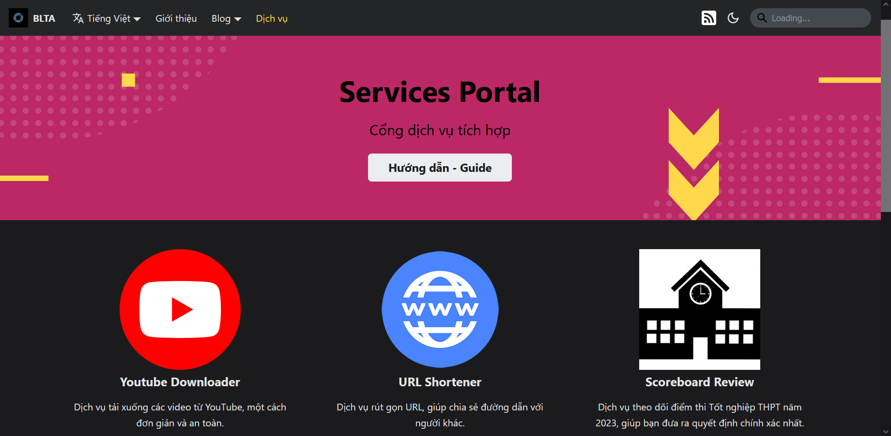

There are several ways to access the Services Portal:

1. Access from [**this link**](../../en/services)
2. From the **Navigation bar** on the top of this page, select **Services**
3. From the **Footer** at the end of this page, in the **Homepage** section select **Services Portal**

The screen will look something like this:

:::note

The image above is just a sample in **Vietnamese**. The actual website will be in **English** and **has the same layout**.

:::

Select a service to use, then click on **Access**. The website will be redirected to the desired service.

From the Services Portal, users can access the guide by clicking on **Hướng dẫn - Guide**.

There are currently six different services as follows:

1. **Youtube Downloader** ([User Guide](./guide/youtube))
2. **URL Shortener** ([User Guide](./guide/shortener))
3. **Scoreboard Review** ([User Guide](./guide/scoreboard))
4. **English L&T** ([User Guide](./guide/english))
5. **Images Gallery** ([User Guide](./guide/gallery))
6. **Status Coverage** ([User Guide](./guide/status))
