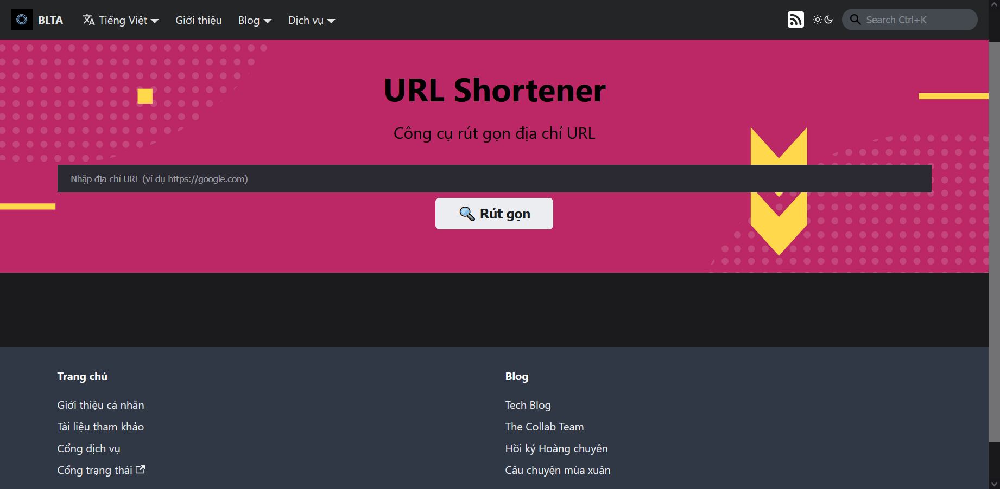

## Introduction

The URL Shortener service allows users to shorten long URLs into short ones, which are easier to share and remember.

## Guide to access

To use the service, there are the following ways:

1. Access from [**this link**](../../../en/services)
2. From the **Navigation bar** on the top of this page, select **Services**
3. From the **Footer** at the end of this page, in the **Homepage** section select **Services Portal**

Select the **URL Shortener** service, then click on **Access**. The website will automatically be redirected to the service page as shown below.

:::note

The image above is just a sample in **Vietnamese**. The actual website will be in **English** and **has the same layout**.

:::

## Guide to interact

Enter the URL that needs to be shortened into the search bar, then click on **Shorten**. The system will automatically shorten the URL and display the result to the user.

In case the user enters an invalid URL, the system will **display an error message**, please check the URL and try again.
